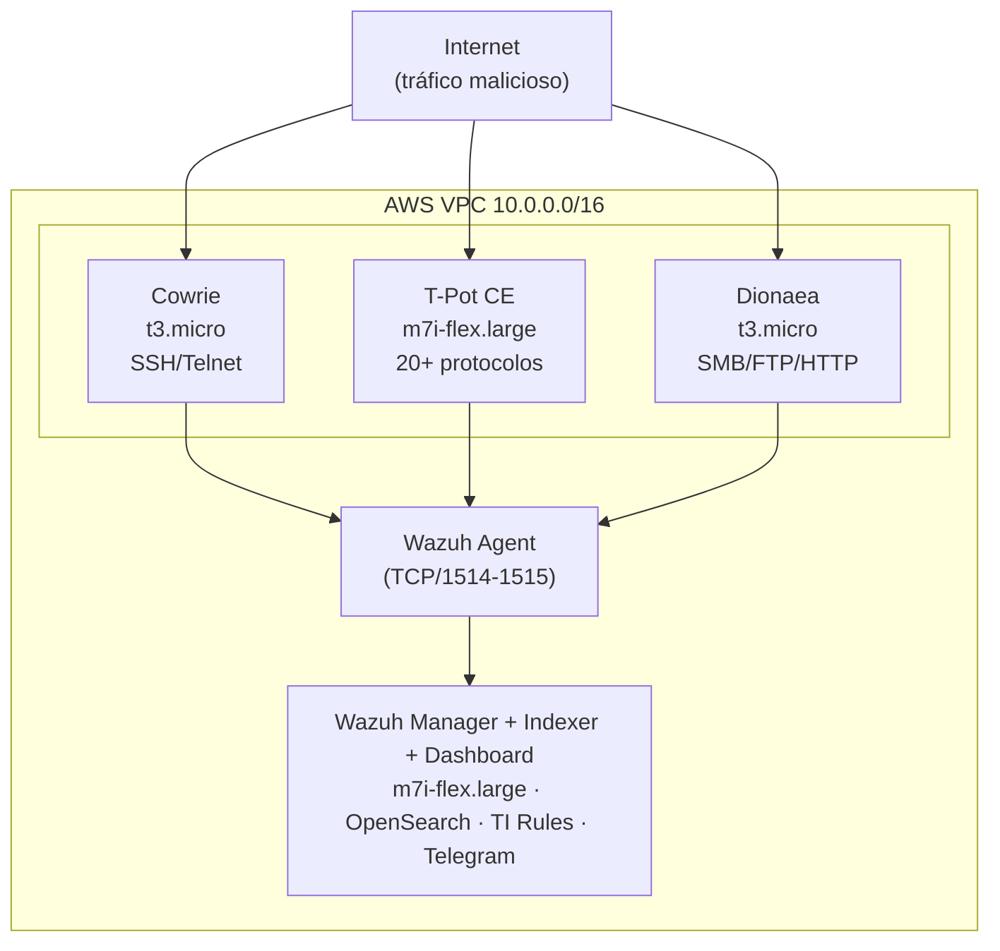

# Cloud HoneyNet & Automated Threat Intelligence

> Red de señuelos (HoneyNet) cloud-native desplegada en AWS durante ~7 días para
> la captura de tráfico malicioso real, correlación automática con feeds de
> Threat Intelligence y mapeo de técnicas MITRE ATT&CK.


---

## Métricas Globales

| Indicador                                   |                                 Valor |
| :------------------------------------------ | ------------------------------------: |
| Total de eventos capturados                 |                           **137,657** |
| Honeypots operativos                        |   **3** (Cowrie · T-Pot CE · Dionaea) |
| Período de operación                        | Período de operación | **~7 días** (estado final con configuración completa) |
| Países de origen identificados              |                               **15+** |
| IPs únicas atacantes                        |                             **> 200** |
| Técnicas MITRE ATT&CK confirmadas           |                                 **6** |
| Alertas de Threat Intelligence              |                                **85** |
| IPs con match en blacklists (score 100/100) |                                 **3** |
| Costo operativo AWS (por 7 días)            |                        **~USD 21.60** |

---

## Arquitectura


El sistema opera en **tres capas**:

| Capa | Componente | Función |
|:----:|:-----------|:--------|
| 1 | Cowrie · T-Pot CE · Dionaea | Captura de tráfico malicioso real |
| 2 | Wazuh Agent (por sensor) | Normalización y transporte de logs |
| 3 | Wazuh Manager + Indexer + Dashboard | Correlación, TI, alertas y visualización |

---

## Hallazgos Críticos

## H1 — Infraestructura de Scanning Coordinado

Tres IPs de AWS (`3.130.168.2`, `3.129.187.38`, `18.218.118.203`) operando  
bajo el dominio `scan.visionheight.com` en una campaña multi-protocolo  
coordinada. AbuseIPDB score **100/100** en las tres · GreyNoise clasificación  
`malicious`. División de tareas por servicio confirmada. Activó la regla de  
correlación multi-honeypot (T1595).

## H2 — Propagación Activa de Botnet SSH en Tiempo Real

La IP `158.51.96.38` (NetInformatik Inc. · AbuseIPDB score **100/100** ·  
reportada por **924 usuarios únicos**) ejecutó un binario malicioso camuflado  
como `sshd` apuntando a 50+ IPs target. Capturado íntegramente por Cowrie  
en sesión activa con TTY log completo (T1059 · T1105).

## H3 — Máquina Hospitalaria Comprometida

La IP `201.187.98.150`, perteneciente a la red del **Hospital Base Valdivia**  
(Chile), generó **64,095 eventos SMB en un solo día** (2026-03-03).  
Comportamiento consistente con malware de propagación activa tipo  
EternalBlue/WannaCry. El host lleva comprometido desde al menos  
2026-01-06 según registros AbuseIPDB (T1021.002).

---

## Estructura del Repositorio
```text
cloud-honeynet-aws/
│
├── README.md                         Este archivo
│
├── docs/
│   ├── 01-despliegue/
│   │   ├── cowrie.md                 Instalación y configuración de Cowrie
│   │   ├── tpot.md                   Instalación y configuración de T-Pot CE
│   │   ├── dionaea.md                Instalación y configuración de Dionaea
│   │   └── wazuh-stack.md            Despliegue del stack Wazuh all-in-one
│   ├── 02-wazuh-integracion/
│   │   ├── reglas-custom.md          Reglas de detección (IDs 100500–100585)
│   │   └── threat-intelligence.md   Pipeline TI — arquitectura y resultados
│   └── 03-analisis/
│   │   ├── hallazgos.md              Análisis de los 3 hallazgos principales
│   │   ├── ioc.md                    IoC estructurados (formato STIX-like)
│   │    └── evidencias-ti/            Reportes AbuseIPDB · GreyNoise por IP 
│   └── 04-informe-final
│
├── configs/
│   └── wazuh/
│       ├── 100-cowrie_rules.xml      Reglas Cowrie SSH/Telnet
│       ├── local_rules.xml           Reglas TI · T-Pot · Dionaea · correlación
│       ├── ossec-agent-cowrie.conf   Configuración del agente Cowrie
│       ├── ossec-agent-tpot.conf     Configuración del agente T-Pot
│       └── ossec-agent-dionaea.conf  Configuración del agente Dionaea
│
├── scripts/
│   ├── telegram/
│   │   └── send_telegram.sh          Notificaciones vía Telegram Bot API
│   └── ti/
│       ├── tienrichment.py           Enriquecimiento con AbuseIPDB/GreyNoise/OTX
│       ├── ti_dryrun_archives.py     Extracción de IPs desde Wazuh archives
│       ├── gen_cdb_from_candidates.py Generación de CDB desde candidates JSONL
│       ├── ti_emit_matches.py        Emisión de matches al socket de analysisd
│       ├── run_ti_pipeline.sh        Orquestador pipeline baseline (sin APIs)
│       └── run_ti_enrichment_v1.sh   Orquestador pipeline enriquecimiento
│
├── queries/
│   ├── README.md                     Guía de uso de queries OpenSearch
│   └── json/                         Exports JSON de las 9 queries principales
│
└── screenshots/
    ├── arquitectura/                  Evidencias del despliegue y configuración en AWS         
    ├── cowrie/                        Evidencias del despliegue Cowrie
    ├── dashboard/                     Capturas del Wazuh Dashboard
    ├── dionaea/                       Evidencias del despliegue Dionaea
    ├── queries/                       Screenshots de queries en DevTools
    ├── ti-reports/                    Screenshots de reportes de AbuseIPDB y GreyNoise
    └── tpot/                          Evidencias del despliegue T-Pot
```

---

## Stack Tecnológico

| Categoría               | Tecnología                                                             | Versión |
| :---------------------- | :--------------------------------------------------------------------- | :------ |
| Cloud                   | Amazon Web Services (EC2, VPC, SG, SSM)                                | —       |
| Honeypot SSH/Telnet     | [Cowrie](https://github.com/cowrie/cowrie)                             | latest  |
| Honeypot multi-servicio | [T-Pot CE](https://github.com/telekom-security/tpotce)                 | 24.04.1 |
| Honeypot SMB/malware    | [Dionaea](https://github.com/DinoTools/dionaea)                        | 0.11.0  |
| SIEM                    | [Wazuh Manager + Indexer + Dashboard](https://documentation.wazuh.com) | 4.14.2  |
| Backend indexación      | OpenSearch                                                             | 2.x     |
| Threat Intelligence     | AbuseIPDB · GreyNoise · AlienVault OTX                                 | —       |
| Alertas en tiempo real  | Telegram Bot API                                                       | —       |
| Framework de referencia | [MITRE ATT&CK](https://attack.mitre.org)                               | v14     |

---

## Técnicas MITRE ATT&CK Confirmadas

| ID        | Técnica                                   | Honeypot       | Evidencia                                      |
| --------- | ----------------------------------------- | -------------- | ---------------------------------------------- |
| T1595     | Active Scanning                           | T-Pot · Cowrie | Campaña visionheight.com · regla 100576        |
| T1110.001 | Brute Force: Password Guessing            | Cowrie         | 44,153 intentos · regla 100504                 |
| T1078     | Valid Accounts                            | Cowrie         | Sesiones autenticadas exitosas                 |
| T1105     | Ingress Tool Transfer                     | Cowrie         | wget/curl hacia C2 en sesiones activas         |
| T1059     | Command and Scripting Interpreter         | Cowrie         | Comandos bash/python capturados · regla 100511 |
| T1021.002 | Remote Services: SMB/Windows Admin Shares | Dionaea        | 64,095 eventos SMB · regla 100584              |


## Costo Operativo AWS
---

## 💰 Costo Operativo AWS

| Recurso | Tipo | Costo estimado / 7 días |
|:--------|:-----|------------------------:|
| Cowrie EC2 | t3.micro | ~USD 0.84 |
| T-Pot CE EC2 | m7i-flex.large | ~USD 8.57 |
| Dionaea EC2 | t3.micro | ~USD 0.84 |
| Wazuh Stack EC2 | m7i-flex.large | ~USD 8.57 |
| Storage EBS + transferencia | — | ~USD 2.78 |
| **TOTAL** | | **~USD 21.60** |

> Los honeynets operaron en estado final de configuración durante **~7 días** (~USD 21.60). 
> El proyecto completo incluyó ~23 días adicionales de despliegue y configuración, con un costo operativo total de ~USD 106.

---
## Documentación

| Sección                                                                                 | Descripción                                             |
| --------------------------------------------------------------------------------------- | ------------------------------------------------------- |
| [Despliegue Cowrie](docs/01-despliegue/cowrie.md)                       | Instalación, configuración y troubleshooting            |
| [Despliegue T-Pot](docs/01-despliegue/tpot.md)                          | Instalación, permisos y escalado de instancia           |
| [Despliegue Dionaea](docs/01-despliegue/dionaea.md)                     | Compilación, fix módulo Python y configuración          |
| [Wazuh Stack](docs/01-despliegue/wazuh-stack.md)                        | All-in-one, archives, index patterns                    |
| [Reglas Custom](docs/02-wazuh-integracion/reglas-custom.md)             | 19 reglas con MITRE y dependencias                      |
| [Threat Intelligence](docs/02-wazuh-integracion/threat-intelligence.md) | Pipeline completo, dos fases, resultados                |
| [Hallazgos](docs/03-analisis/hallazgos.md)                              | Análisis técnico de H1, H2 y H3                         |
| [IoC](docs/03-analisis/ioc.md)                                          | Indicadores estructurados formato STIX-like             |
| [Evidencias TI](docs/03-analisis/evidencias-ti/README.md)               | Reportes AbuseIPDB y GreyNoise por IP                   |
| [Scripts](scripts/README.md)                                            | Referencia del pipeline TI y notificaciones             |
| [Configs](configs/README.md)                                            | Archivos de configuración listos para desplegar         |
| [Queries](configs/queries/README.md)                                    | Consultas OpenSearch para hunting                       |
| [Informe Final](docs/04-informe-final.md)                               | Documento de síntesis de todo el proyecto y resultados. |

## Aviso Legal y Ético

Este proyecto operó exclusivamente en **modo pasivo de captura**. No se
ejecutaron contramedidas activas, escaneos ofensivos ni ataques hacia los
sistemas identificados, en cumplimiento estricto de la
[AWS Acceptable Use Policy](https://aws.amazon.com/aup/).

Los indicadores de compromiso (IoC) documentados tienen únicamente fines
académicos y de investigación en ciberseguridad defensiva (Blue Team).

---

## Informe Completo

→ [`docs/04-informe-final.md`](docs/04-informe-final.md)

---

## Autor

**K.B** · Ingeniería de Telecomunicaciones · Blue Team / Threat Intelligence  
Lima, Perú · 2026
