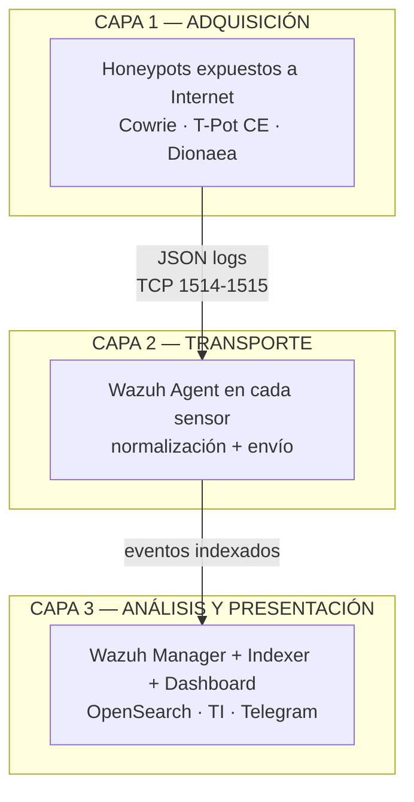
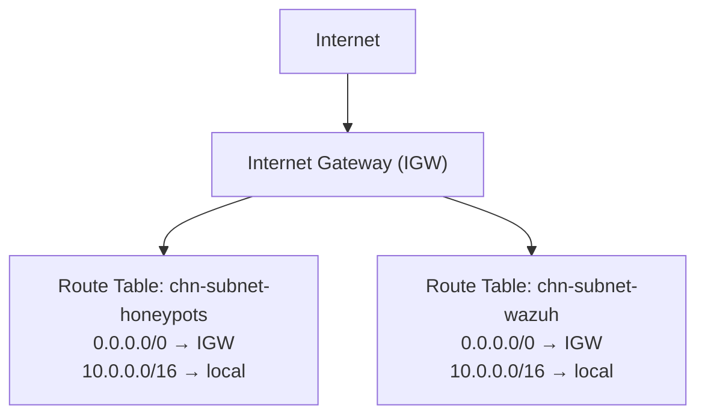
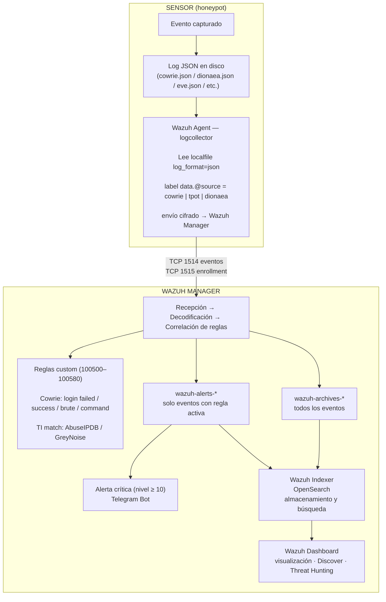

# Arquitectura del Sistema

> Este documento describe la arquitectura real implementada durante la operación
> del proyecto (2026-02-04 → 2026-03-06). Algunos valores difieren del diseño
> inicial donde se tomaron decisiones técnicas durante la implementación;
> dichas diferencias se señalan explícitamente.

---

## Tabla de Contenidos

1. [Visión General](#1-visión-general)
2. [Infraestructura AWS](#2-infraestructura-aws)
3. [Red: VPC, Subnets y Enrutamiento](#3-red-vpc-subnets-y-enrutamiento)
4. [Security Groups por Instancia](#4-security-groups-por-instancia)
5. [Network ACLs](#5-network-acls)
6. [Pipeline de Datos](#6-pipeline-de-datos)
7. [Acceso Administrativo](#7-acceso-administrativo)
8. [Decisiones de Diseño y Cambios Respecto al Plan Inicial](#8-decisiones-de-diseño-y-cambios-respecto-al-plan-inicial)

---

## 1. Visión General

La HoneyNet se estructura en **tres capas funcionales** completamente independientes:

---

## 2. Infraestructura AWS

### 2.1 Instancias EC2

| Rol | Nombre interno | Instance Type | SO | IP privada | Puertos expuestos (inbound público) |
|:----|:--------------|:-------------|:---|:-----------|:------------------------------------|
| Honeypot SSH/Telnet | Cowrie | **t3.micro** | Ubuntu 22.04 LTS | `10.0.10.36` | TCP/22 · TCP/23 |
| Honeypot multi-servicio | T-Pot CE | **m7i-flex.large** | Ubuntu 22.04 LTS | `10.0.10.76` | TCP+UDP/1–64000 |
| Honeypot SMB/malware | Dionaea | **t3.micro** | Ubuntu 24.04 LTS | `10.0.10.154` | TCP/21 · 80 · 445 · 1433 |
| SIEM central | Wazuh Stack | **m7i-flex.large** | Ubuntu 22.04 LTS | `10.0.20.51` | TCP/443 (dashboard) · 1514 · 1515 |
> **Evidencia:** Consola AWS — EC2 Instances
> 

> **Nota:** El plan inicial contemplaba T-Pot CE en `t3.small`. Se escaló a
> `m7i-flex.large` durante la implementación por los requisitos de memoria del
> stack Docker de T-Pot (20+ contenedores simultáneos).

### 2.2 Instance IDs (referencia)

| Instancia | Instance ID |
|:----------|:------------|
| Cowrie | `i-0d96a8152d9c004ec` |
| T-Pot CE | `i-070eb1a67939cdd25` |
| Dionaea | `i-0e8c4a42243c5d40a` |
| Wazuh Stack | `i-068d997b895a0ed8c` |

### 2.3 Componentes de Software

| Componente | Versión | Instalación |
|:-----------|:--------|:------------|
| Cowrie | latest (git) | Virtualenv Python · `/home/cowrie/cowrie` |
| T-Pot CE | **24.04.1** | Script oficial `install.sh` · Docker Compose |
| Dionaea | **0.11.0** | Compilado desde fuente · `/opt/dionaea` |
| Wazuh Manager | **4.14.2** | Paquete APT oficial |
| Wazuh Indexer | **4.14.2-1** | Co-instalado con Manager |
| Wazuh Dashboard | **4.14.2-1** | Co-instalado con Manager |
| Wazuh Agent (sensores) | **4.14.3-1** | Paquete APT oficial |

> **Nota:** El plan inicial especificaba Wazuh 4.9. Se implementó **4.14.2**
> (versión estable disponible al momento del despliegue).

---

## 3. Red: VPC, Subnets y Enrutamiento

### 3.1 VPC

| Parámetro        | Valor                     |
| :--------------- | :------------------------ |
| VPC ID           | `vpc-01b772a4cca66614f`   |
| CIDR             | `10.0.0.0/16`             |
| Región           | `us-east-1` (N. Virginia) |
| Internet Gateway | Habilitado                |

### 3.2 Subnets

| Nombre                        | CIDR           | Tipo    | Contenido                |
| :---------------------------- | :------------- | :------ | :----------------------- |
| `chn-subnet-honeypots`        | `10.0.10.0/24` | Pública | Cowrie · T-Pot · Dionaea |
| `chn-subnet-wazuh`            | `10.0.20.0/24` | Pública | Wazuh Stack              |
| `chn-subnet-private-reserved` | `10.0.30.0/24` | Privada | -                        |
> **Evidencia:** Consola AWS — VPC Subnets
> 

> **Nota sobre diseño:** El plan contemplaba una subnet privada adicional
> (`private-reserved`) para extensiones futuras. Se creo en la
> implementación, sin embargo al no ser necesaria no se utilizo, lo cual no modifica el alcance del proyecto.

### 3.3 Enrutamiento

### 3.4 Elastic IPs

Se asignó una Elastic IP estática a cada instancia EC2 para mantener
direccionamiento público fijo durante toda la operación (facilita
whitelisting y trazabilidad de eventos).

---

## 4. Security Groups por Instancia

### 4.1 `chn-sg-cowrie` — Cowrie

| Dirección | Protocolo | Puerto(s)  | Origen/Destino  | Justificación                  |
| :-------- | :-------- | :--------- | :-------------- | :----------------------------- |
| Inbound   | TCP       | 22, 23     | `0.0.0.0/0`     | Exposición honeypot SSH/Telnet |
| Inbound   | TCP       | 22222      | `<IP-admin>/32` | Acceso SSH administrativo      |
| Outbound  | TCP       | 1514, 1515 | `chn-sg-wazuh`  | Wazuh Agent → Manager          |

> El honeypot escucha en TCP/22 y TCP/23 (redireccionados internamente
> por NAT PREROUTING a los puertos 2222/2223 donde corre Cowrie).
> El acceso administrativo usa el puerto **22222** para separarlo del
> canal honeypot.

### 4.2 `chn-sg-tpot` — T-Pot CE

| Dirección | Protocolo | Puerto(s) | Origen/Destino | Justificación |
|:----------|:----------|:----------|:---------------|:-------------|
| Inbound | TCP+UDP | 1–64000 | `0.0.0.0/0` | Exposición multi-protocolo honeypots |
| Inbound | TCP | 64295 | `<IP-admin>/32` | SSH administrativo T-Pot |
| Inbound | TCP | 64297 | `<IP-admin>/32` | WebUI T-Pot |
| Outbound | TCP | 1514, 1515 | `chn-sg-wazuh` | Wazuh Agent → Manager |

> T-Pot CE reasigna el SSH del sistema operativo al puerto **64295**
> durante la instalación. La WebUI corre en **64297** (HTTPS).

### 4.3 `chn-sg-dionaea` — Dionaea

| Dirección | Protocolo | Puerto(s) | Origen/Destino | Justificación |
|:----------|:----------|:----------|:---------------|:-------------|
| Inbound | TCP | 21, 80, 445, 1433 | `0.0.0.0/0` | FTP · HTTP · SMB · MSSQL honeypot |
| Inbound | TCP | 22 | `<IP-admin>/32` | Acceso SSH administrativo |
| Outbound | TCP | 1514, 1515 | `chn-sg-wazuh` | Wazuh Agent → Manager |

### 4.4 `chn-sg-wazuh` — Wazuh Stack

| Dirección | Protocolo | Puerto(s) | Origen/Destino | Justificación |
|:----------|:----------|:----------|:---------------|:-------------|
| Inbound | TCP | 1514, 1515 | `chn-sg-cowrie`, `chn-sg-tpot`, `chn-sg-dionaea` | Recepción de agentes |
| Inbound | TCP | 443 | `<IP-admin>/32` | Acceso al Dashboard |
| Outbound | TCP | Efímeros | `0.0.0.0/0` | Respuestas TCP (stateful) |

---

## 5. Network ACLs

Se aplicaron NACLs como **segunda capa de control stateless** para reforzar
el aislamiento a nivel de subnet, complementando los Security Groups (stateful).

### `chn-nacl-honeypots`

| Regla | Tipo | Puerto(s) | Origen | Acción |
|:------|:-----|:----------|:-------|:-------|
| 100 | Inbound · TCP | ALL | `0.0.0.0/0` | ALLOW |
| 200 | Inbound · UDP | ALL | `0.0.0.0/0` | ALLOW |
| * | Inbound | ALL | ALL | DENY |
| 100 | Outbound · TCP | 1514, 1515 | `10.0.20.0/24` | ALLOW |
| 200 | Outbound · TCP | 1024–65535 | `0.0.0.0/0` | ALLOW (retorno) |
| * | Outbound | ALL | ALL | DENY |

> **Incidente resuelto durante implementación:** La regla DENY TCP 1024–65535
> outbound estaba numerada como regla 40, precediendo al ALLOW de 1514/1515.
> Se renumeró a 300 para que los ALLOWs de los puertos de Wazuh tuvieran
> precedencia correcta.

### `chn-nacl-wazuh`

| Regla | Tipo | Puerto(s) | Origen | Acción |
|:------|:-----|:----------|:-------|:-------|
| 100 | Inbound · TCP | 1514, 1515 | `10.0.10.0/24` | ALLOW |
| 200 | Inbound · TCP | 443 | `<IP-admin>/32` | ALLOW |
| * | Inbound | ALL | ALL | DENY |
| 100 | Outbound · TCP | 1024–65535 | `10.0.10.0/24` | ALLOW |
| * | Outbound | ALL | ALL | DENY |

---

## 6. Pipeline de Datos

### Etiquetado estándar por sensor

| Sensor | Tag en Wazuh | Filtro en Discover |
|:-------|:-------------|:-------------------|
| Cowrie | `data.@source: "cowrie"` | `data.@source:"cowrie"` |
| T-Pot CE | `data.@source: "tpot"` | `data.@source:"tpot"` |
| Dionaea | `data.@source: "dionaea"` | `data.@source:"dionaea"` |

---

## 7. Acceso Administrativo

El acceso administrativo a todas las instancias se realizó **sin exponer
puertos SSH en los Security Groups de gestión** siempre que fue posible,
siguiendo el principio de mínima exposición:

| Instancia | Método de acceso admin | Puerto |
|:----------|:----------------------|:-------|
| Cowrie | SSH directo (puerto alterno) | TCP/22222 |
| T-Pot CE | SSH directo (T-Pot reasigna el puerto) | TCP/64295 |
| Dionaea | SSH directo | TCP/22 (restringido a IP admin) |
| Wazuh Stack | **AWS SSM Session Manager** (sin SSH expuesto) + SSH restringido | SSM / TCP/22 |

> AWS SSM Session Manager permite acceso a la consola del sistema sin
> necesidad de abrir el puerto 22, eliminando ese vector de ataque en la
> instancia más crítica del proyecto.

---

## 8. Decisiones de Diseño y Cambios Respecto al Plan Inicial

| Aspecto | Plan inicial | Implementación real | Motivo del cambio |
|:--------|:------------|:--------------------|:------------------|
| T-Pot instance type | `t3.small` | `m7i-flex.large` | Requisitos de RAM para Docker stack de 20+ honeypots |
| Wazuh versión | 4.9 | **4.14.2** | Versión estable disponible al momento del despliegue |
| Subnet privada | Contemplada (`private-reserved`) | No creada | No necesaria para el alcance final del proyecto |
| Acceso admin Wazuh | SSH convencional | **SSM Session Manager** | Hardening: eliminar puerto 22 de la instancia más crítica |
| Puerto admin Cowrie | No especificado | **TCP/22222** | Separación clara entre canal honeypot (22) y canal admin |
| Transporte de logs | Wazuh Agent + Filebeat | **Wazuh Agent únicamente** | Suficiente para el volumen y latencia requeridos; simplifica la arquitectura |
| Captura de binarios Dionaea | Habilitada | **Parcialmente** (archivos `.tmp` de 0 bytes) | Egress cerrado previene descarga completa de payloads — decisión consciente para evitar pivoting |
| Período de operación | 7 días | **30 días** | Decisión de extender para maximizar captura y análisis |
| Costo operativo | ≤ USD 30 / 7 días | ~USD 106 / 30 días (~USD 24.7/semana) | Consecuencia directa de la extensión del período |

---

## Referencias

- [Wazuh Documentation — Agent configuration](https://documentation.wazuh.com/current/user-manual/reference/ossec-conf/client.html)
- [T-Pot CE — System Requirements](https://github.com/telekom-security/tpotce#system-requirements)
- [AWS VPC Security Groups](https://docs.aws.amazon.com/vpc/latest/userguide/vpc-security-groups.html)
- [AWS SSM Session Manager](https://docs.aws.amazon.com/systems-manager/latest/userguide/session-manager.html)
