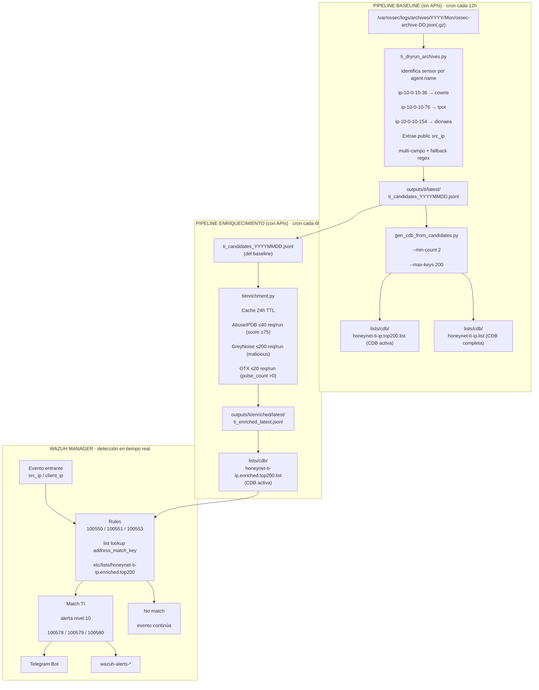

# Integración de Threat Intelligence — Pipeline Real

> **Componente:** Wazuh Manager v4.14.2  
> **Ubicación de scripts:** `scripts/ti/` · `scripts/telegram/`  
> **Feeds:** AbuseIPDB v2 · GreyNoise Community · AlienVault OTX  
> **Resultado en ~7 días de operación:** 85 alertas TI · 3 IPs score 100/100

---

## Tabla de Contenidos

1. [Descripción General](#1-descripción-general)
2. [Arquitectura del Pipeline](#2-arquitectura-del-pipeline)
3. [Scripts — Referencia](#3-scripts--referencia)
4. [Pipeline Baseline](#4-pipeline-baseline-run_ti_pipelinesh)
5. [Pipeline de Enriquecimiento API](#5-pipeline-de-enriquecimiento-api-run_ti_enrichment_v1sh)
6. [Emisión a Wazuh](#6-emisión-a-wazuh-ti_emit_matchespy)
7. [Notificaciones Telegram](#7-notificaciones-telegram)
8. [CDB — Formato y Ubicación](#8-cdb--formato-y-ubicación)
9. [Secretos y Variables de Entorno](#9-secretos-y-variables-de-entorno)
10. [Automatización con Cron](#10-automatización-con-cron)
11. [Reglas Wazuh que Consumen la CDB](#11-reglas-wazuh-que-consumen-la-cdb)
12. [Resultados de la Operación](#12-resultados-de-la-operación)
13. [Hallazgos Confirmados por TI](#13-hallazgos-confirmados-por-ti)

---

## 1. Descripción General

El sistema TI del proyecto opera con **dos pipelines complementarios**:

| Pipeline | Script orquestador | Función | Dependencia externa |
|:---------|:------------------|:--------|:-------------------|
| **Baseline** | `run_ti_pipeline.sh` | Extrae IPs de los archives de Wazuh y genera una CDB por frecuencia de aparición | Ninguna — 100% local |
| **Enriquecimiento** | `run_ti_enrichment_v1.sh` | Consulta AbuseIPDB, GreyNoise y OTX y genera una CDB con niveles de confianza | APIs externas |

Ambos pipelines convergen en una **CDB local** que Wazuh consulta en tiempo
real para cada evento entrante de los honeypots. La ventaja de este diseño
es que el motor de detección no tiene latencia de red — la consulta a las
APIs ocurre de forma asíncrona y fuera del path crítico.

---

## 2. Arquitectura del Pipeline



---

## 3. Scripts — Referencia
```text
scripts/  
├── telegram/  
│ └── send_telegram.sh Envía mensajes via Telegram Bot API  
└── ti/  
├── tienrichment.py Enriquecimiento con AbuseIPDB/GreyNoise/OTX  
├── ti_dryrun_archives.py Extrae IPs de los archives de Wazuh  
├── gen_cdb_from_candidates.py Genera CDB desde candidates JSONL  
├── ti_emit_matches.py Emite matches TI al socket de analysisd  
├── run_ti_pipeline.sh Orquestador del pipeline baseline  
└── run_ti_enrichment_v1.sh Orquestador del pipeline de enriquecimiento
```
---

## 4. Pipeline Baseline — `run_ti_pipeline.sh`

El orquestador del pipeline baseline ejecuta los siguientes pasos
en secuencia en cada ejecución:

### Paso 1 — Construcción del input 48h

Lee los archives de Wazuh de las últimas 48 horas con lógica de fallback:

Intento 1: .gz de ayer (validación gzip antes de descomprimir)  
Intento 2: .json descomprimido de ayer  
Intento 3: fallback a anteayer (si ayer está ausente/corrupto/ENOSPC)  
+ Hoy (.json o .gz, con verificación de integridad)

```bash
# Ruta de los archives
/var/ossec/logs/archives/YYYY/Mon/ossec-archive-DD.json[.gz]

# Input consolidado resultante
~/inputs/wazuh_archives_48h.jsonl         ← stable (sobreescrito)
~/inputs/wazuh_archives_48h_TIMESTAMP.jsonl ← snapshot con timestamp
```

> El fallback a anteayer evita que el pipeline falle completamente  
> por un archivo corrupto o ausente por falta de espacio en disco.

## Paso 2 — Extracción de IPs: `ti_dryrun_archives.py`

```bash
python3 scripts/ti/ti_dryrun_archives.py \
  --input ~/inputs/wazuh_archives_48h.jsonl \
  --outdir outputs/ti/runs/TIMESTAMP/
```

**Identificación de sensor por `agent.name`:**

|agent.name|Sensor|
|---|---|
|`ip-10-0-10-36`|cowrie|
|`ip-10-0-10-76`|tpot|
|`ip-10-0-10-154`|dionaea|

**Extracción de IP — estrategia multi-campo:**

```text
1. Campos directos: data.src_ip, data.srcip, data.connection.src_ip
2. Parseo de full_log como JSON (clave para Dionaea y Suricata)
3. Fallback regex IPv4 en full_log
→ Solo IPs públicas (descarta private/loopback/link-local/reserved)
```

**Salidas:**

```text
outputs/ti/runs/TIMESTAMP/ti_candidates_YYYYMMDD.jsonl  ← IPs + conteo + metadatos
outputs/ti/runs/TIMESTAMP/ti_top_YYYYMMDD.txt           ← Resumen Top N por sensor
outputs/ti/latest/                                       ← Symlink al run más reciente
```

**Formato de un registro en `ti_candidates_YYYYMMDD.jsonl`:**

```json
{
  "@source": "cowrie",
  "src_ip": "158.51.96.38",
  "count": 847,
  "sample_timestamp": "2026-02-20T14:23:11.000Z",
  "sample_rule_id": "100502",
  "sample_rule_desc": "Cowrie: login failed (base for correlation, no_log).",
  "sample_agent_name": "ip-10-0-10-36",
  "generated_at_utc": "2026-02-21T02:00:00Z"
}
```

## Paso 3 — Generación de CDB: `gen_cdb_from_candidates.py`

```bash
python3 scripts/ti/gen_cdb_from_candidates.py \
  --input outputs/ti/runs/TIMESTAMP/ti_candidates_YYYYMMDD.jsonl \
  --output lists/cdb/honeynet-ti-ip.list \
  --top-output lists/cdb/honeynet-ti-ip.top200.list \
  --min-count 2 \
  --max-keys 200
```

|Parámetro|Valor|Significado|
|---|---|---|
|`--min-count`|2|Excluye IPs con solo 1 aparición (reduce falsos positivos)|
|`--max-keys`|200|TOP-200 por volumen de eventos|

**Formato de la CDB generada:**
```text
158.51.96.38:src=cowrie;count=847;tag=ti_candidate
201.187.98.150:src=dionaea;count=64095;tag=ti_candidate
3.130.168.2:src=tpot,cowrie;count=312;tag=ti_candidate
```

## Paso 4 — Rotación automática

```text
outputs/ti/runs/   → elimina runs > 7 días
~/inputs/          → conserva solo los últimos 6 snapshots
```

---

## 5. Pipeline de Enriquecimiento API — `run_ti_enrichment_v1.sh`

Complementa el pipeline baseline consultando las APIs de TI para  
asignar niveles de confianza a las IPs candidatas.

## Script principal: `tienrichment.py`

```bash
python3 scripts/ti/tienrichment.py
```

**Configuración (archivo `~/.honeynet_ti.env`):**
```bash
ABUSEIPDB_API_KEY=<clave>
GREYNOISE_API_KEY=<clave>
OTX_API_KEY=<clave>
```

**Límites por ejecución (free tiers):**

|Feed|Límite/run|Criterio high-confidence|
|---|---|---|
|AbuseIPDB|40 requests|score ≥ 75|
|GreyNoise Community|200 requests|classification == `malicious`|
|AlienVault OTX|20 requests|pulse_count > 0|

**Cache local (24h TTL):**

```text
scripts/ti/cache/tienrichment_cache.json
```

Evita re-consultar IPs ya enriquecidas en las últimas 24 horas,  
preservando la cuota diaria de las APIs free tier.

**Lógica de confianza:**

```python
# high:   AbuseIPDB score >= 75  OR  GreyNoise == "malicious"  OR  OTX pulses > 0
# medium: AbuseIPDB score >= 25  OR  GreyNoise == "unknown"
# low:    sin señales positivas en ningún feed
```

**Salidas:**

```text
outputs/ti/enriched/latest/ti_enriched_latest.jsonl  ← enriquecido completo
lists/cdb/honeynet-ti-ip.enriched.list               ← CDB con all IPs:confidence
lists/cdb/honeynet-ti-ip.enriched.top200.list        ← TOP-200 high:confidence
```

**Formato CDB enriquecida:**

```text
3.130.168.2:high
158.51.96.38:high
201.187.98.150:high
45.22.15.99:medium
```

**Sincronización con Wazuh Manager:**

La CDB que Wazuh Manager lee debe estar en su ruta de listas:

```bash
sudo cp ~/lists/cdb/honeynet-ti-ip.enriched.top200.list \
    /var/ossec/etc/lists/honeynet-ti-ip.enriched.top200
sudo systemctl restart wazuh-manager
```

## 6. Emisión a Wazuh — `ti_emit_matches.py`

Script auxiliar que emite matches TI **directamente al socket Unix**  
de `analysisd`, generando eventos que activan las reglas sin necesidad  
de esperar un log file.

```pythop
python3 scripts/ti/ti_emit_matches.py
```

**Flujo:**

```text
1. Leer ti_candidates_*.jsonl (outputs/ti/latest/)
2. Leer CDB enriched.top200
3. Para cada IP candidate que está en la CDB Y no fue vista antes:
   → Escribe en /var/log/honeynet-ti/ti_matches.jsonl (auditoría)
   → Envía al socket /var/ossec/queue/sockets/queue
   → Registra IP en seen (evita duplicados entre ejecuciones)
```

**Formato del mensaje al socket:**
```text
1:[honeynet-ti]:/var/log/honeynet-ti/ti_matches.jsonl:{json_payload}
```

> `ti_emit_matches.py` actúa como complemento del pipeline pasivo:  
> mientras las reglas 100550/100551/100553 hacen match en tiempo real  
> sobre eventos que llegan de los agentes, `ti_emit_matches.py` permite  
> forzar la emisión de alertas TI sobre IPs históricas que ya estaban  
> en el archivo de candidatos pero cuya alerta no se generó en su momento.

## 7. Notificaciones Telegram

## `send_telegram.sh`

```bash
# Uso
scripts/telegram/send_telegram.sh "Mensaje de prueba"

# Carga credenciales desde
secrets/telegram.env     # → BOT_TOKEN + CHAT_ID
```

## Integración en los pipelines
| Pipeline                  | Mensaje enviado                                             |
| ------------------------- | ----------------------------------------------------------- |
| `run_ti_pipeline.sh`      | Top N IPs del `ti_top_YYYYMMDD.txt` (truncado a 3500 chars) |
| `run_ti_enrichment_v1.sh` | Top 5 High por honeypot con score AbuseIPDB y OTX pulses    |

## 8. CDB — Formato y Ubicación

|Archivo|Generado por|Wazuh la lee desde|
|---|---|---|
|`honeynet-ti-ip.top200.list`|`gen_cdb_from_candidates.py`|Baseline, sin API|
|`honeynet-ti-ip.enriched.top200.list`|`tienrichment.py`|Con API (confianza)|
|(activa en Wazuh)|manual `cp` + restart|`/var/ossec/etc/lists/honeynet-ti-ip.enriched.top200`|

> La CDB activa en Wazuh es la **enriched**, que combina frecuencia +  
> validación por APIs. La baseline es útil para análisis offline y como  
> input del enriquecimiento.

## 9. Secretos y Variables de Entorno

|Archivo|Contenido|Permisos|
|---|---|---|
|`~/.honeynet_ti.env`|`ABUSEIPDB_API_KEY`, `GREYNOISE_API_KEY`, `OTX_API_KEY`|`600`|
|`secrets/telegram.env`|`BOT_TOKEN`, `CHAT_ID`|`600`|

```bash
# Crear y asegurar el env de TI
touch ~/.honeynet_ti.env
chmod 600 ~/.honeynet_ti.env

# Verificar que no están en el repo
cat .gitignore | grep -E "secrets|\.env|\.pem"
```


---

## 10. Automatización con Cron

```bash
sudo crontab -e -u root
```

```text
# Pipeline baseline — cada 12 horas
0 */12 * * * /home/ubuntu/scripts/ti/run_ti_pipeline.sh \
    >> /var/log/honeynet-ti/ti_pipeline.log 2>&1

# Pipeline enriquecimiento API — cada 6 horas
0 */6 * * * /home/ubuntu/scripts/ti/run_ti_enrichment_v1.sh \
    >> /var/log/honeynet-ti/ti_enrichment_v1.log 2>&1
```

Verificar ejecuciones:
```bash
tail -30 /var/log/honeynet-ti/ti_pipeline.log
tail -30 /var/log/honeynet-ti/ti_enrichment_v1.log

# Confirmar rotación activa
ls -lh ~/outputs/ti/runs/ | head -10
```

## 11. Reglas Wazuh que Consumen la CDB

Ver detalles completos en  
[`docs/02-wazuh-integracion/reglas-custom.md`](./reglas-custom.md)

| Regla  | Sensor  | Campo         | CDB consultada                   |
| ------ | ------- | ------------- | -------------------------------- |
| 100550 | Cowrie  | `src_ip`      | `honeynet-ti-ip.enriched.top200` |
| 100578 | Cowrie  | (hijo 100550) | —                                |
| 100551 | T-Pot   | `client_ip`   | `honeynet-ti-ip.enriched.top200` |
| 100579 | T-Pot   | (hijo 100551) | —                                |
| 100553 | Dionaea | `src_ip`      | `honeynet-ti-ip.enriched.top200` |
| 100580 | Dionaea | (hijo 100553) | —                                |
## 12. Resultados de la Operación
|Métrica|Valor|
|---|---|
|Total alertas TI generadas|**85**|
|IPs confirmadas score 100/100|**3**|
|IPs high-confidence enriquecidas|3+|
|Runs del pipeline baseline|~14 (cada 12h × 7 días)|
|Runs del pipeline enrichment|~28 (cada 6h × 7 días)|
|Cache hits (evitaron llamadas API)|Mayoría de IPs repetidas|
## 13. Hallazgos Confirmados por TI

## `3.130.168.2` · `3.129.187.38` · `18.218.118.203`

**Dominio:** `scan.visionheight.com` · **ASN:** Amazon AWS  
**AbuseIPDB:** Score 100/100 · **GreyNoise:** `malicious`  
Campaña de scanning global multi-protocolo con tres instancias AWS  
actuando de forma coordinada con división de tareas por servicio.

## `158.51.96.38`

**Organización:** NetInformatik Inc.  
**AbuseIPDB:** Score 100/100 · **924 usuarios** distintos lo reportaron  
Ejecutó binario malicioso camuflado como `sshd` en directorio oculto,  
apuntando a 50+ IPs target en una sola sesión Cowrie. Evidencia de botnet  
SSH con propagación activa capturada en tiempo real.

## `201.187.98.150`

**Organización:** Hospital Base Valdivia (Chile)  
64,095 eventos SMB en un solo día (2026-03-03). Consistente con malware  
tipo EternalBlue/WannaCry activo en infraestructura sanitaria comprometida.

> Estos IoC se documentan con fines académicos y de investigación defensiva.  
> No se ejecutaron contramedidas activas hacia ninguna de estas IPs.

## Referencias

- [AbuseIPDB — API v2](https://docs.abuseipdb.com/)
    
- [GreyNoise — Community API](https://docs.greynoise.io/)
    
- [AlienVault OTX](https://otx.alienvault.com/)
    
- [Wazuh — CDB Lists](https://documentation.wazuh.com/current/user-manual/ruleset/cdb-list.html)
    
- [Wazuh — analysisd socket](https://documentation.wazuh.com/current/user-manual/reference/statistics-files/wazuh-analysisd-state.html)
    
